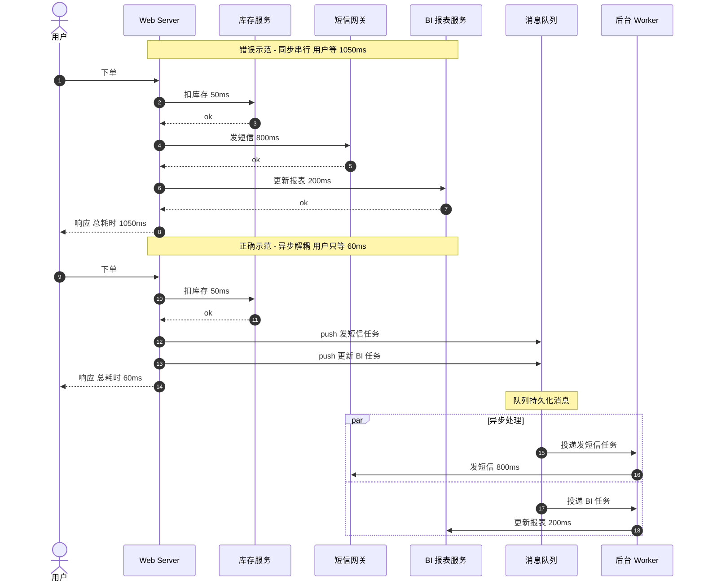
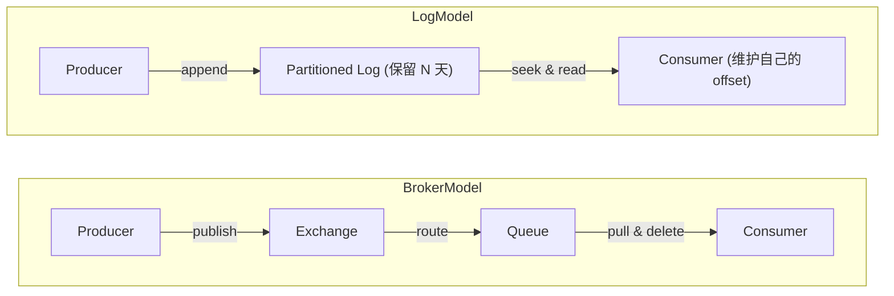
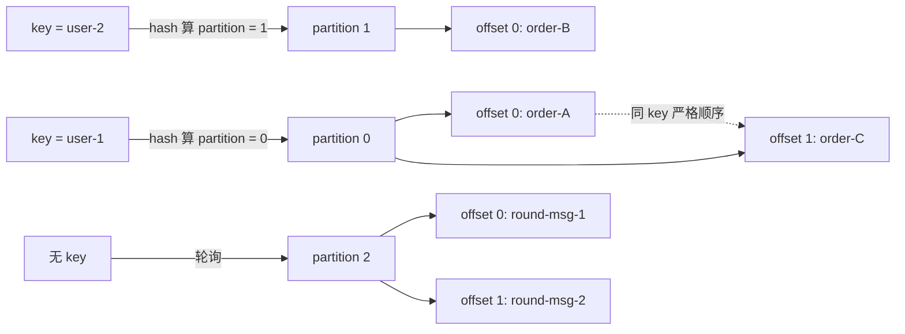
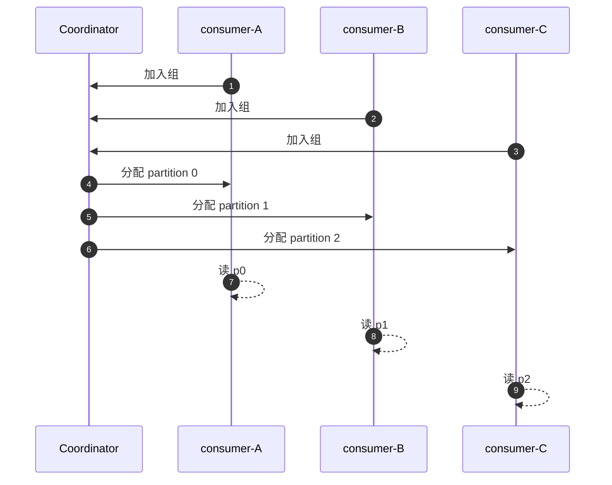
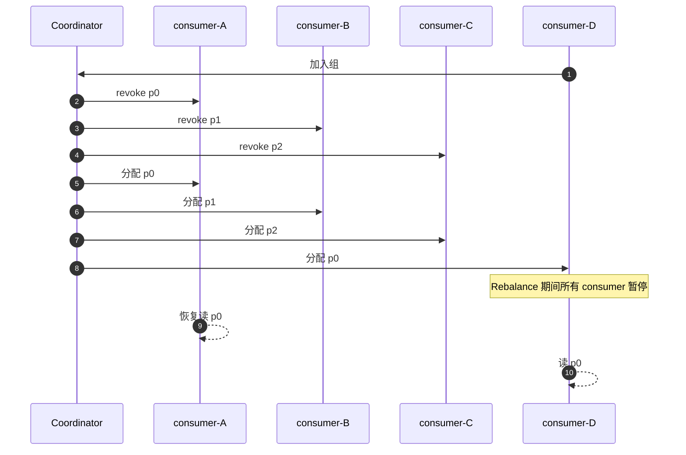
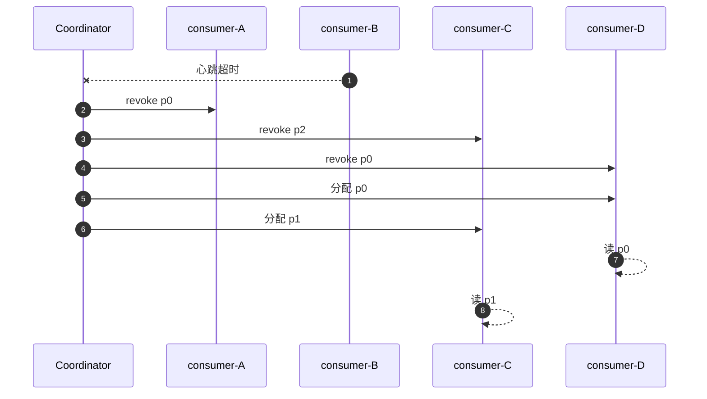
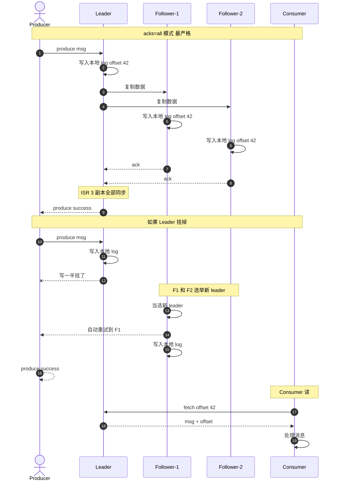
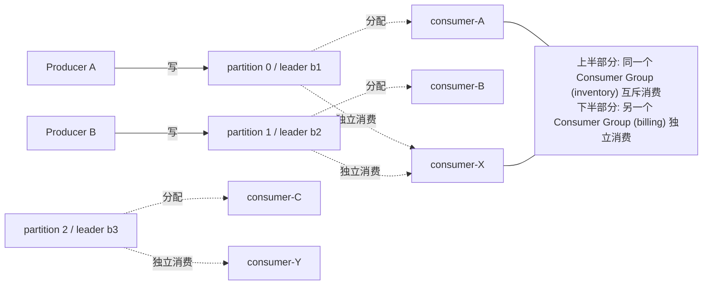
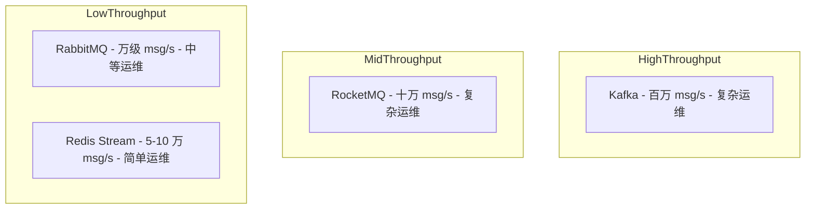
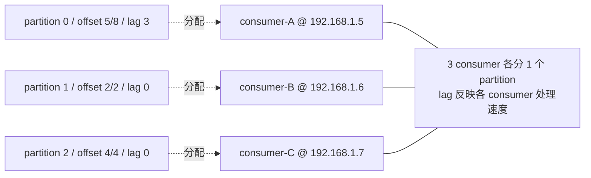

# Kafka 入门教程

> **目标读者**：0 基础但会基本命令行操作的开发者
> **预计时长**：2-3 小时阅读 + 实操
> **技术栈**：不限语言，重概念与 CLI 操作
> **版本基线**：Kafka 3.6+（KRaft 模式，不再依赖 ZooKeeper）

---

## 目录

- [第 1 章：消息队列与 Kafka 是什么](#第-1-章消息队列与-kafka-是什么)
- [第 2 章：Kafka vs RabbitMQ / RocketMQ / Redis Stream 选型](#第-2-章kafka-vs-rabbitmq--rocketmq--redis-stream-选型)
- [第 3 章：三种部署方式（Docker / Compose / 原生）](#第-3-章三种部署方式docker--compose--原生)
- [第 4 章：Kafka CLI 实战](#第-4-章kafka-cli-实战)
- [第 5 章：跨语言客户端速查](#第-5-章跨语言客户端速查)
- [附录 A：常见问题 FAQ](#附录-a常见问题-faq)
- [附录 B：故障排查速查](#附录-b故障排查速查)
- [附录 C：参考资料](#附录-c参考资料)

---

# 第 1 章：消息队列与 Kafka 是什么

## 1.1 为什么需要消息队列

在讲 Kafka 之前，先看一个真实场景。

假设你运营一个电商网站。用户下单后，系统要做三件事：

1. **扣库存**（必须立刻做，否则超卖）
2. **发短信通知**（晚 5 分钟没关系）
3. **更新 BI 报表**（晚几小时也没关系）

如果把三件事串行写在 `OrderController::place()` 里：

```php
// 错误示范：把不紧急的事也同步做
$order = Order::create(...);
Inventory::deduct($order);   // 50ms
Sms::send($order->user);     // 800ms（短信网关）
BI::record($order);          // 200ms（远程 BI 接口）

return response()->json(['order_id' => $order->id]);  // 用户等了 1050ms
```

用户等了 1 秒多才看到下单成功——因为短信网关抽风了。**这不合理**。

正确做法：扣完库存立即返回，下单这件事变成"待发短信"和"待记 BI"两条消息扔到队列里。后台 worker 异步处理慢的那两件。

```php
// 正确示范：消息队列解耦
$order = Order::create(...);
Inventory::deduct($order);                  // 50ms
Queue::push(new SendOrderSms($order));      // 5ms
Queue::push(new RecordOrderBi($order));     // 5ms

return response()->json(['order_id' => $order->id]);  // 用户只等 60ms
```

这就是消息队列的核心价值：**用异步解耦把"必须同步做的"和"可以稍后做的"分开**。

#### 同步 vs 异步 时序对比



> **关键点**：用户响应时间从 1050ms 降到 60ms，慢操作完全不阻塞主流程。

### 消息队列解决的 4 类问题

| 问题 | 没有 MQ 时 | 有 MQ 后 |
| --- | --- | --- |
| **解耦** | A 服务调 B、C、D 服务，调用链脆 | A 只发消息，B/C/D 各自订阅 |
| **异步** | 用户等所有慢操作完成 | 用户立即拿到响应，慢操作后台跑 |
| **削峰** | 秒杀 10 万 QPS 把下游打挂 | 消息先堆积在 broker，消费者按能力拉 |
| **可恢复** | 进程崩了，任务丢失 | 消息持久化在 broker，进程恢复后继续 |

## 1.2 消息队列的两种主流模型

消息队列发展 20 多年，沉淀出**两种本质不同的架构**：

### 模型 A：Broker 转发模式（RabbitMQ / RocketMQ 代表）

```
Producer → Exchange → Queue → Consumer
```

- 消息被 Exchange 路由到 Queue，消费者从 Queue 拉
- **消息被消费后从 broker 删除**（除非显式持久化 + 手动 ack）
- 单条消息投递语义强（ack / nack / 重投 / 死信）
- 类似"邮局取信"模型

### 模型 B：分布式日志模式（Kafka 代表）

```
Producer → Topic（一个或多个 Partition）→ Consumer
```

- 消息是**追加写**到 partition 日志里，**不**因消费而删除
- 按 offset 顺序读，consumer 维护自己的 offset
- 消息保留期由 `retention.ms` 控制（默认 7 天）
- 类似"报纸订阅"模型——报纸印出来就一直存在，你可以随时回头看

### 关键差异

| 维度 | Broker 模式 | 日志模式 |
| --- | --- | --- |
| 消息保留 | 消费即删（或显式 ack） | 持久化保留 N 天 |
| 重放历史 | 困难（消息已删） | 原生支持（按 offset / 时间回放） |
| 投递语义 | at-least-once / at-most-once | at-least-once / **exactly-once**（事务） |
| 顺序保证 | 单 queue 内有序 | **单 partition 内有序**（跨 partition 无序） |
| 适用场景 | 任务队列、RPC 解耦 | 事件流、日志聚合、流式处理 |

**Kafka 是日志模式的代表**。这两种模型没有"谁更好"，只有"谁更适合你的场景"。

#### 两种模型 架构对比



> 模型 A 标题：Broker 转发（消息取走就没了）
>
> 模型 B 标题：分布式日志（消息印出来一直在）

```
┌─────────────────── Broker 模式 ───────────────────┐   ┌─────────────────── 日志模式（Kafka）────────────────────┐
│                                                    │   │                                                          │
│  Producer ──publish──> Exchange ──route──> Queue  │   │   Producer ──append──> [Partition 0: msg0 msg1 msg2 ...]  │
│                                       │           │   │                          [Partition 1: msg0 msg1 msg2 ...]  │
│                                       │           │   │                          [Partition 2: msg0 msg1 msg2 ...]  │
│                                       ▼           │   │                                  │                          │
│                                  Consumer         │   │                                  │ seek by offset           │
│                                  (消费即删)        │   │                                  ▼                          │
│                                                    │   │                       Consumer A: offset=5               │
│  类比：邮局取信                                       │   │                       Consumer B: offset=2 (不同组)         │
│  取走就没了                                           │   │                                                          │
│                                                    │   │   类比：报纸订阅                                              │
│                                                    │   │   报纸印出来就一直存在，可重读                                    │
│  代表：RabbitMQ / RocketMQ                            │   │   代表：Kafka / Pulsar                                       │
└────────────────────────────────────────────────────┘   └──────────────────────────────────────────────────────────┘
```

> 一眼看本质区别：**Broker 模式**消息"取走就没了"，**日志模式**消息"印出来一直在"——重放历史是 Kafka 的杀手锏。

## 1.3 Kafka 是什么

> 官方定义：Apache Kafka 是一个**分布式事件流平台**（distributed event streaming platform）。

三个关键词：

1. **分布式**：多 broker 组成集群，提供高可用与水平扩展
2. **事件流**：以事件（消息）流为核心，而不是单一任务队列
3. **平台**：不仅是消息队列，还包括流式处理（Kafka Streams）、生态集成（Kafka Connect、Schema Registry）

### Kafka 的 5 个核心能力

| 能力 | 含义 | 典型应用 |
| --- | --- | --- |
| **发布 / 订阅** | 消息按 topic 分发，多消费者可独立订阅 | 订单事件通知 |
| **持久化** | 消息写入磁盘，按保留期保存 | 日志聚合、审计 |
| **流处理** | Kafka Streams / ksqlDB 做实时聚合 | 实时大屏、风控 |
| **存储** | 充当持久化的事件存储层 | 事件溯源（Event Sourcing） |
| **集成** | Kafka Connect 连接外部系统 | 数据库 CDC、搜索引擎 |

### Kafka 不擅长的

- **极低延迟（< 5ms）的请求-响应**：用 Redis / gRPC 更合适
- **复杂路由规则**：RabbitMQ 的 Exchange + Binding 更灵活
- **每条消息独立 ack 语义**：RabbitMQ 在这一点上更精细

## 1.4 Kafka 核心概念

理解 Kafka 必须先吃透 6 个核心概念。我用一个电商下单的例子串起来。

### 概念 1：Broker

Kafka 集群由若干个 **broker** 组成。每个 broker 是个独立的 Kafka 进程，负责接收、存储、转发消息。

```
┌─────────┐  ┌─────────┐  ┌─────────┐
│Broker-1 │  │Broker-2 │  │Broker-3 │
│  :9092  │  │  :9092  │  │  :9092  │
└─────────┘  └─────────┘  └─────────┘
       └────────────┴────────────┘
              Kafka Cluster
```

生产环境一般 3 起步，5~7 常见。**broker 不是消费者也不是生产者**，它只管"存消息 + 转发消息"。

### 概念 2：Topic（主题）

消息按 **topic** 分类。生产者和消费者都面向 topic。

- `orders.created` —— 订单创建事件
- `orders.paid` —— 订单支付事件
- `inventory.changed` —— 库存变更事件
- `sms.send` —— 待发短信

类比：topic 就像"报纸的栏目"——财经、体育、科技各一个栏目。

### 概念 3：Partition（分区）

一个 topic 可以分成多个 **partition**，分布在不同 broker 上。

```
topic: orders.created
  ├── partition 0  → Broker-1（leader）/ Broker-2（follower）
  ├── partition 1  → Broker-2（leader）/ Broker-3（follower）
  └── partition 2  → Broker-3（leader）/ Broker-1（follower）
```

**关键特性**：

- **每个 partition 是一份有序的日志**（append-only log）
- **partition 内部有序，跨 partition 无序**——这个特性决定了"想全局有序必须用 1 个 partition"
- partition 数决定最大并行消费者数（一个 partition 同一时刻只能被消费者组里一个消费者读）
- 生产环境一般 6-12 个 partition 起步

类比：partition 就像"报纸的版面"——体育版周一、周二、周三各一份。

#### Partition 分布 + Key 路由



> **关键点**：相同 key 永远落同一 partition，partition 内 offset 严格递增——这就是 Kafka 顺序保证的物理基础。

### 概念 4：Offset（位移）

partition 里的每条消息有一个递增的 **offset**（从 0 开始）。

```
partition 0:
  offset 0:  msg #1
  offset 1:  msg #2
  offset 2:  msg #3
  offset 3:  msg #4   ← Consumer 读到这
```

**关键特性**：

- offset 是 partition 级别的，不是 topic 级别
- offset 由 consumer 自己维护（提交给 broker 或保存本地）
- 消息被消费后**不删除**——只是 offset 往前走
- 保留期到了（默认 7 天）才真正删除

类比：offset 就像"读者夹在报纸里的书签"——书签可以随时换。

### 概念 5：Producer（生产者）

向 topic 写消息的角色。

```java
// 伪代码
Producer<String, String> producer = new KafkaProducer<>(props);
producer.send(new ProducerRecord<>("orders.created", "order-123", "{...}"));
```

生产者可以指定：

- **topic**（必填）
- **key**（可选，用于决定消息落哪个 partition）
- **value**（消息体）
- **partition**（可选，显式指定）
- **timestamp**（可选）
- **headers**（可选，附加元数据）

### 概念 6：Consumer（消费者）

从 topic 读消息的角色。

```java
// 伪代码
Consumer<String, String> consumer = new KafkaConsumer<>(props);
consumer.subscribe(List.of("orders.created"));
while (running) {
    ConsumerRecords<String, String> records = consumer.poll(Duration.ofSeconds(1));
    for (ConsumerRecord<String, String> r : records) {
        process(r);
    }
}
```

### 概念 7：Consumer Group（消费者组）

多个 consumer 组成一个 **consumer group**，共同消费一个 topic。

```
orders.created (3 partitions)

Consumer Group: "inventory-workers"
  ├── consumer-A  →  partition 0
  ├── consumer-B  →  partition 1
  └── consumer-C  →  partition 2
```

**关键特性**：

- **一个 partition 同一时刻只被组内一个 consumer 消费**（保证不重复）
- 组内 consumer 数 ≤ partition 数时，每个 consumer 分到 1+ 个 partition
- 组内 consumer 数 > partition 数时，多余的 consumer 闲着
- **不同 consumer group 各自维护 offset**，所以同一份消息可以被多个 group 独立消费

类比：consumer group 就像"一支快递队"——3 个快递员分 3 个片区的快递。

#### Consumer Group Rebalance 流程

Kafka 同一个 Group 的 partition 分配是"动态协议"——3 张时序图分别展示 3 个关键时刻。

##### 阶段 1：初始加入



##### 阶段 2：新 consumer 加入触发 rebalance



##### 阶段 3：consumer 崩溃触发 rebalance



> **关键**：rebalance 期间所有 consumer 短暂停消费——这是 Kafka 的"硬停机"，扩容要谨慎。

### 概念 8：Replication（副本）

每个 partition 有 1 个 **leader** 和 N 个 **follower**（N 由 `replication.factor` 决定，通常 3）。

- **leader 负责所有读写**
- **follower 从 leader 拉数据做备份**
- leader 挂了，follower 选举出新 leader
- 副本数越多越安全，但占磁盘也越多

```
partition 0:
  ├── Leader   (Broker-1)   ← 读写都走它
  ├── Follower (Broker-2)   ← 备份
  └── Follower (Broker-3)   ← 备份
```

#### Replication 写入与 ISR 同步流程



> **关键**：`acks=all` + `replication.factor=3` + `min.insync.replicas=2` 是生产环境的"三件套"——缺一就有数据风险。

### 概念全景图

把 8 个概念串起来看：



```
                       Producers
                          │
                          │  写 message（带 key）
                          ▼
┌──────────────────────────────────────────────────────────────────┐
│  Kafka Cluster (3 brokers)                                       │
│                                                                  │
│  Topic: orders.created                                           │
│  ┌──────────────────┐ ┌──────────────────┐ ┌──────────────────┐ │
│  │ partition 0      │ │ partition 1      │ │ partition 2      │ │
│  │ msg0 msg1 msg2   │ │ msg0 msg1        │ │ msg0             │ │
│  │ msg3             │ │                  │ │                  │ │
│  │ (leader=b1)      │ │ (leader=b2)      │ │ (leader=b3)      │ │
│  │ (replicas 1/2/3) │ │ (replicas 2/3/1) │ │ (replicas 3/1/2) │ │
│  └──────────────────┘ └──────────────────┘ └──────────────────┘ │
└──────────────────────────────────────────────────────────────────┘
       │              │              │
       ▼              ▼              ▼
Consumer Group: "inventory"     (组内互斥)
  consumer-A    consumer-B    consumer-C
  读 p0         读 p1         读 p2

Consumer Group: "billing"       (另一组，独立消费)
  consumer-X                   consumer-Y
  读 p0+p1                     读 p2
```

## 1.5 关键术语速查

| 术语 | 含义 | 备注 |
| --- | --- | --- |
| **broker** | Kafka 服务器节点 | 集群由 N 个 broker 组成 |
| **topic** | 消息分类 | 业务上对应一类事件 |
| **partition** | topic 的分片 | 决定并行度与顺序边界 |
| **offset** | 消息在 partition 里的位置 | 0 开始的递增整数 |
| **producer** | 消息生产者 | 把消息写到 topic |
| **consumer** | 消息消费者 | 从 topic 拉消息 |
| **consumer group** | 消费者组 | 组内 partition 互斥，组间独立 |
| **replication** | 副本数 | 默认 1，生产建议 3 |
| **leader / follower** | partition 的主从角色 | 只有 leader 接受读写 |
| **ISR** | in-sync replicas | 与 leader 同步的副本集合 |
| **acks** | 生产者写入确认级别 | 0 / 1 / all |
| **rebalance** | 消费者组内 partition 再分配 | 加 / 减消费者时触发 |
| **retention** | 消息保留时间 | 默认 7 天 |
| **broker.id** | broker 的唯一标识 | 集群内不重复 |
| **ZooKeeper / KRaft** | 集群元数据管理 | 3.x 默认 KRaft，2.x 默认 ZK |

## 1.6 小结

- 消息队列解决 4 类问题：解耦 / 异步 / 削峰 / 可恢复
- 主流模型 2 种：broker 转发（RabbitMQ）与分布式日志（Kafka）
- Kafka 5 大能力：发布订阅 / 持久化 / 流处理 / 存储 / 集成
- 8 个核心概念：broker / topic / partition / offset / producer / consumer / consumer group / replication
- 关键认知：partition 内部有序、跨 partition 无序；消息不删，靠 offset 推进

下一章我们用 4 组件对比帮你搞清"什么时候该用 Kafka，什么时候该用别的"。

---

# 第 2 章：Kafka vs RabbitMQ / RocketMQ / Redis Stream 选型

## 2.1 选型维度

评估一个消息中间件看 7 个维度：

| 维度 | 含义 | 影响什么 |
| --- | --- | --- |
| **消息模型** | 队列 vs 日志 | 能否重放、保留期、投递语义 |
| **吞吐量** | 单 broker 峰值 msg/s | 高并发场景 |
| **延迟** | 生产到消费的 P99 | 实时性要求 |
| **持久化** | 消息是否落盘 | 数据可靠性 |
| **顺序保证** | 全局 / 分区 / 无 | 业务强依赖顺序 |
| **生态成熟度** | 客户端 / 监控 / 文档 | 团队上手成本 |
| **运维复杂度** | 部署 / 监控 / 故障恢复 | 团队规模 / 业务关键性 |

## 2.2 Kafka 详解

**定位**：分布式事件流平台（distributed event streaming platform）

**核心特性**：

- 日志模型，消息保留 N 天可重放
- 单 broker 百万级 msg/s 写入
- P99 延迟 5-20ms（取决于 acks 与 replication）
- 强顺序保证（同 partition）
- 生态最完整：Connect、Streams、Schema Registry、MirrorMaker

**优势场景**：

- 高吞吐事件流（用户行为、日志、指标）
- 跨服务事件通知
- 流式处理（实时聚合、风控）
- 数据集成（CDC 同步、ETL）
- 事件溯源（Event Sourcing）

**劣势场景**：
- 极低延迟请求-响应
- 复杂路由规则
- 团队无 Kafka 运维经验且业务不重

## 2.3 RabbitMQ 详解

**定位**：传统 AMQP（Advanced Message Queuing Protocol）消息代理

**核心特性**：
- Broker 转发模型，Exchange + Queue + Binding 灵活路由
- 单 broker 万级 msg/s 写入
- P99 延迟 1-5ms（无持久化）/ 5-30ms（持久化）
- 单 queue 内强顺序
- 成熟的 ack / nack / 死信队列（DLQ）/ 延迟队列等机制

**优势场景**：
- 任务队列、RPC 解耦
- 复杂路由（topic / direct / fanout / headers 多种 Exchange）
- 严格的每条消息确认语义
- 老牌中间件、文档最全

**劣势场景**：
- 消息量极大（百万 msg/s）
- 需要重放历史消息
- 跨语言流式处理

## 2.4 RocketMQ 详解

**定位**：阿里开源的金融级消息中间件

**核心特性**：
- 日志模型（受 Kafka 启发但做了一些增强）
- 单 broker 十万级 msg/s
- P99 延迟 2-10ms
- 支持事务消息（强一致的分布式事务）
- 严格的顺序消息（全局有序 Topic）
- 阿里大规模生产验证（双 11 场景）

**优势场景**：
- 金融、支付、订单等强一致场景
- 需要事务消息
- 中国本土团队，文档中文友好
- 阿里系技术栈

**劣势场景**：
- 生态主要在 Java（其他语言客户端弱）
- 海外社区相对小
- 运维工具不如 Kafka 丰富

## 2.5 Redis Stream 详解

**定位**：Redis 5.0+ 内置的轻量级消息流

**核心特性**：
- 基于 Redis 内存存储的日志结构
- 单 Redis 实例 5-10 万 msg/s
- P99 延迟 1ms 级（内存访问）
- 单 stream 内有序
- 极轻量，无需额外集群

**优势场景**：

- 已有 Redis 基础设施，不想引新组件
- 消息量中等（< 10 万 msg/s）
- 极低延迟（< 5ms）
- 轻量事件流、通知、任务队列

**劣势场景**：
- 高吞吐（百万级）
- 长期持久化（Redis 内存成本高）
- 复杂路由 / 事务消息
- 大集群场景

## 2.6 四组件对比表

| 维度 | Kafka | RabbitMQ | RocketMQ | Redis Stream |
| --- | --- | --- | --- | --- |
| **模型** | 分布式日志 | 队列 + 路由 | 分布式日志 | 轻量日志 |
| **吞吐量** | 百万 msg/s | 万级 msg/s | 十万 msg/s | 5-10 万 msg/s |
| **P99 延迟** | 5-20ms | 1-30ms | 2-10ms | < 1ms |
| **消息保留** | 可配置（默认 7 天） | 消费即删 | 可配置 | 可配置 |
| **顺序保证** | 单 partition 有序 | 单 queue 有序 | 全局或分区可选 | 单 stream 有序 |
| **事务消息** | ✅ 0.11+ | ✅ AMQP tx | ✅ 强一致 | ❌ |
| **死信队列** | 需自实现 | ✅ 原生 | ✅ 原生 | ❌ |
| **延迟消息** | 需自实现 | ✅ 插件 | ✅ 18 档 | ❌ |
| **多语言客户端** | Java/Python/Go/... 全 | Java/Python/Go/... 全 | Java 强，其他弱 | 任何 Redis client |
| **生态成熟度** | ★★★★★ | ★★★★★ | ★★★★ | ★★★ |
| **运维复杂度** | 高（需 ZK/KRaft 集群） | 中（单点故障靠镜像） | 高 | 低（复用 Redis） |
| **团队学习曲线** | 陡 | 中 | 中 | 平缓 |
| **典型用户** | LinkedIn / Uber / Netflix | 各类企业 | 阿里 / 中国金融 | 已有 Redis 的中小项目 |

#### 四组件定位（按吞吐 + 运维复杂度二维）



> **解读**：
>
> - **理想区**（高吞吐 + 简单运维）目前**没有**完美产品
> - **Kafka** 牺牲运维复杂度换最高吞吐
> - **Redis Stream** 牺牲吞吐换最简运维
> - **RabbitMQ / RocketMQ** 在中间地带，按业务场景选

> **注**：Mermaid 原生 `quadrantChart` 是 9.4+ 新图表（GitLab 老版 / VSCode 插件不支持），本图改用 `graph TB` 三组 subgraph 表达同一信息。

## 2.7 选型决策树

```
开始
  │
  ▼
Q1: 消息量 > 50 万 msg/s？
  ├─ 是 → 强候选 Kafka
  └─ 否 ↓
       │
       ▼
Q2: 需要重放历史消息？
  ├─ 是 → 强候选 Kafka
  └─ 否 ↓
       │
       ▼
Q3: 需要事务消息（跨服务强一致）？
  ├─ 是 → Kafka 0.11+ / RocketMQ
  └─ 否 ↓
       │
       ▼
Q4: 需要复杂路由（topic / direct / headers）？
  ├─ 是 → RabbitMQ
  └─ 否 ↓
       │
       ▼
Q5: 已有 Redis 集群，且消息量 < 5 万 msg/s？
  ├─ 是 → Redis Stream（最轻）
  └─ 否 ↓
       │
       ▼
Q6: 团队 Java 为主 + 阿里系生态？
  ├─ 是 → RocketMQ
  └─ 否 ↓
       │
       ▼
默认 → Kafka（生态最完整，社区最大）
```

## 2.8 经典场景对照

| 场景 | 推荐 | 理由 |
| --- | --- | --- |
| 电商订单异步通知 | Kafka | 事件流、未来可能流式处理（实时大屏） |
| 用户注册发短信 / 邮件 | RabbitMQ | 任务队列、延迟消息、死信处理 |
| 金融支付事务 | RocketMQ | 事务消息、严格顺序 |
| 实时日志聚合 | Kafka | 高吞吐、保留期可配置 |
| 微服务间解耦 | RabbitMQ / Kafka | 取决于规模 |
| 已有 Redis 的轻量通知 | Redis Stream | 复用基础设施 |
| 跨数据中心复制 | Kafka（MirrorMaker） | 官方工具成熟 |
| IoT 设备数据接入 | Kafka | 高吞吐、宽生态 |

## 2.9 小结

- **Kafka** 适合：高吞吐、事件流、需要重放、未来要流式处理
- **RabbitMQ** 适合：任务队列、复杂路由、严格 ack
- **RocketMQ** 适合：金融场景、事务消息、Java 团队
- **Redis Stream** 适合：轻量通知、已有 Redis 设施

**没有"最好"，只有"最适合"**。如果团队是初学者、消息量中等、想用生态最广的——**选 Kafka 出错概率最低**。

下一章我们用 3 种部署方式让你在 10 分钟内跑通一个本地 Kafka。

---

# 第 3 章：三种部署方式（Docker / Compose / 原生）

## 3.1 方案 A：Docker 单 broker（10 分钟上手）

**适用**：本地开发、学习、PoC

**优点**：一行命令、零配置、跨平台

**缺点**：单 broker 无副本、无高可用

### 步骤 1：确认 Docker 已装

```bash
docker --version
# 期望：Docker version 24.0+ 或更新
```

如果没装：去 [docker.com](https://www.docker.com/products/docker-desktop/) 装 Docker Desktop。

### 步骤 2：拉镜像并启动

KRaft 模式（Kafka 3.x 推荐，不再依赖 ZooKeeper）：

```bash
docker run -d \
  --name kafka \
  -p 9092:9092 \
  -e KAFKA_NODE_ID=1 \
  -e KAFKA_PROCESS_ROLES=broker,controller \
  -e KAFKA_LISTENERS=PLAINTEXT://0.0.0.0:9092,CONTROLLER://0.0.0.0:9093 \
  -e KAFKA_ADVERTISED_LISTENERS=PLAINTEXT://localhost:9092 \
  -e KAFKA_CONTROLLER_LISTENER_NAMES=CONTROLLER \
  -e KAFKA_CONTROLLER_QUORUM_VOTERS=1@localhost:9093 \
  -e KAFKA_LISTENER_SECURITY_PROTOCOL_MAP=CONTROLLER:PLAINTEXT,PLAINTEXT:PLAINTEXT \
  -e KAFKA_INTER_BROKER_LISTENER_NAME=PLAINTEXT \
  -e KAFKA_OFFSETS_TOPIC_REPLICATION_FACTOR=1 \
  -e KAFKA_TRANSACTION_STATE_LOG_REPLICATION_FACTOR=1 \
  -e KAFKA_TRANSACTION_STATE_LOG_MIN_ISR=1 \
  bitnami/kafka:3.6
```

### 步骤 3：验证启动

```bash
docker logs kafka | tail -20
# 期望最后几行包含 "Kafka Server started" 或 "started successfully"
```

### 步骤 4：进入容器测试

```bash
docker exec -it kafka bash

# 进入容器后，bin 目录有所有 CLI 工具
ls /opt/bitnami/kafka/bin/

# 创建一个测试 topic
/opt/bitnami/kafka/bin/kafka-topics.sh \
  --create \
  --topic test \
  --bootstrap-server localhost:9092

# 列出所有 topic
/opt/bitnami/kafka/bin/kafka-topics.sh \
  --list \
  --bootstrap-server localhost:9092
```

成功！本地 Kafka 已经跑起来了。

### 步骤 5：停止 / 启动

```bash
# 停止
docker stop kafka

# 启动
docker start kafka

# 删除容器（数据丢失）
docker rm -f kafka
```

## 3.2 方案 B：Docker Compose 3 节点集群

**适用**：学习多 broker 行为、测试 partition 分配、模拟真实集群

**优点**：3 broker 真实分布式、可以体验 rebalance、副本机制

**缺点**：占资源（3 容器约 2GB 内存）、配置复杂

### 步骤 1：创建 docker-compose.yml

新建文件 `kafka-cluster.yml`：

```yaml
version: '3.8'

services:
  kafka-1:
    image: bitnami/kafka:3.6
    container_name: kafka-1
    ports:
      - "9092:9092"
    environment:
      KAFKA_NODE_ID: 1
      KAFKA_PROCESS_ROLES: broker,controller
      KAFKA_LISTENERS: PLAINTEXT://0.0.0.0:9092,CONTROLLER://0.0.0.0:9093
      KAFKA_ADVERTISED_LISTENERS: PLAINTEXT://localhost:9092
      KAFKA_CONTROLLER_LISTENER_NAMES: CONTROLLER
      KAFKA_CONTROLLER_QUORUM_VOTERS: 1@kafka-1:9093,2@kafka-2:9093,3@kafka-3:9093
      KAFKA_LISTENER_SECURITY_PROTOCOL_MAP: CONTROLLER:PLAINTEXT,PLAINTEXT:PLAINTEXT
      KAFKA_INTER_BROKER_LISTENER_NAME: PLAINTEXT
      KAFKA_OFFSETS_TOPIC_REPLICATION_FACTOR: 3
      KAFKA_TRANSACTION_STATE_LOG_REPLICATION_FACTOR: 3
      KAFKA_TRANSACTION_STATE_LOG_MIN_ISR: 2
      KAFKA_AUTO_CREATE_TOPICS_ENABLE: 'true'
    networks:
      - kafka-net

  kafka-2:
    image: bitnami/kafka:3.6
    container_name: kafka-2
    ports:
      - "9094:9092"
    environment:
      KAFKA_NODE_ID: 2
      KAFKA_PROCESS_ROLES: broker,controller
      KAFKA_LISTENERS: PLAINTEXT://0.0.0.0:9092,CONTROLLER://0.0.0.0:9093
      KAFKA_ADVERTISED_LISTENERS: PLAINTEXT://localhost:9094
      KAFKA_CONTROLLER_LISTENER_NAMES: CONTROLLER
      KAFKA_CONTROLLER_QUORUM_VOTERS: 1@kafka-1:9093,2@kafka-2:9093,3@kafka-3:9093
      KAFKA_LISTENER_SECURITY_PROTOCOL_MAP: CONTROLLER:PLAINTEXT,PLAINTEXT:PLAINTEXT
      KAFKA_INTER_BROKER_LISTENER_NAME: PLAINTEXT
      KAFKA_OFFSETS_TOPIC_REPLICATION_FACTOR: 3
      KAFKA_TRANSACTION_STATE_LOG_REPLICATION_FACTOR: 3
      KAFKA_TRANSACTION_STATE_LOG_MIN_ISR: 2
      KAFKA_AUTO_CREATE_TOPICS_ENABLE: 'true'
    networks:
      - kafka-net

  kafka-3:
    image: bitnami/kafka:3.6
    container_name: kafka-3
    ports:
      - "9096:9092"
    environment:
      KAFKA_NODE_ID: 3
      KAFKA_PROCESS_ROLES: broker,controller
      KAFKA_LISTENERS: PLAINTEXT://0.0.0.0:9092,CONTROLLER://0.0.0.0:9093
      KAFKA_ADVERTISED_LISTENERS: PLAINTEXT://localhost:9096
      KAFKA_CONTROLLER_LISTENER_NAMES: CONTROLLER
      KAFKA_CONTROLLER_QUORUM_VOTERS: 1@kafka-1:9093,2@kafka-2:9093,3@kafka-3:9093
      KAFKA_LISTENER_SECURITY_PROTOCOL_MAP: CONTROLLER:PLAINTEXT,PLAINTEXT:PLAINTEXT
      KAFKA_INTER_BROKER_LISTENER_NAME: PLAINTEXT
      KAFKA_OFFSETS_TOPIC_REPLICATION_FACTOR: 3
      KAFKA_TRANSACTION_STATE_LOG_REPLICATION_FACTOR: 3
      KAFKA_TRANSACTION_STATE_LOG_MIN_ISR: 2
      KAFKA_AUTO_CREATE_TOPICS_ENABLE: 'true'
    networks:
      - kafka-net

networks:
  kafka-net:
    driver: bridge
```

### 步骤 2：启动

```bash
docker compose -f kafka-cluster.yml up -d
# 或 docker-compose -f kafka-cluster.yml up -d（旧版命令）
```

### 步骤 3：验证集群

```bash
# 进入任一 broker 容器
docker exec -it kafka-1 bash

# 查看集群元数据
/opt/bitnami/kafka/bin/kafka-metadata-quorum.sh \
  --bootstrap-server localhost:9092 \
  describe --status
```

应该看到 3 个 broker 都在线。

### 步骤 4：创建 3-partition / replication=3 的 topic

```bash
docker exec -it kafka-1 /opt/bitnami/kafka/bin/kafka-topics.sh \
  --create \
  --topic orders \
  --partitions 3 \
  --replication-factor 3 \
  --bootstrap-server localhost:9092
```

### 步骤 5：查看 partition 分布

```bash
docker exec -it kafka-1 /opt/bitnami/kafka/bin/kafka-topics.sh \
  --describe \
  --topic orders \
  --bootstrap-server localhost:9092
```

输出示例：

```
Topic: orders    Partition: 0    Leader: 1    Replicas: 1,2,3    Isr: 1,2,3
Topic: orders    Partition: 1    Leader: 2    Replicas: 2,3,1    Isr: 2,3,1
Topic: orders    Partition: 2    Leader: 3    Replicas: 3,1,2    Isr: 3,1,2
```

可以看到 3 个 partition 分布在 3 个 broker 上，每个 partition 都有 3 个副本。

### 步骤 6：停止集群

```bash
docker compose -f kafka-cluster.yml down
# 保留数据
docker compose -f kafka-cluster.yml down --volumes  # 删数据
```

## 3.3 方案 C：本地原生安装

**适用**：需要最接近生产的环境、容器无法使用、性能基准测试

**优点**：性能最好、无抽象层、贴近部署

**缺点**：平台差异大、配置复杂、单机占资源

### macOS 安装

```bash
# 推荐用 Homebrew
brew install kafka

# 启动（KRaft 模式）
# 注意：brew 装的 Kafka 通常会自动配置成 KRaft
brew services start kafka

# 检查
brew services list | grep kafka
```

或者手动下载：

```bash
# 下载最新版本
curl -O https://archive.apache.org/dist/kafka/3.6.1/kafka_2.13-3.6.1.tgz
tar -xzf kafka_2.13-3.6.1.tgz
cd kafka_2.13-3.6.1

# KRaft 模式启动（Kafka 3.x 默认）
KAFKA_CLUSTER_ID="$(./bin/kafka-storage.sh random-uuid)"
./bin/kafka-storage.sh format -t $KAFKA_CLUSTER_ID -c config/kraft/server.properties
./bin/kafka-server-start.sh config/kraft/server.properties
```

### Linux 安装

```bash
wget https://archive.apache.org/dist/kafka/3.6.1/kafka_2.13-3.6.1.tgz
tar -xzf kafka_2.13-3.6.1.tgz
sudo mv kafka_2.13-3.6.1 /opt/kafka
cd /opt/kafka

KAFKA_CLUSTER_ID="$(./bin/kafka-storage.sh random-uuid)"
./bin/kafka-storage.sh format -t $KAFKA_CLUSTER_ID -c config/kraft/server.properties
./bin/kafka-server-start.sh config/kraft/server.properties
```

### Windows 安装

Windows 用户**强烈建议**用 Docker 方案，原生安装需要 Java + 配置环境变量较麻烦。

如果一定要原生：

1. 安装 Java JDK 17+
2. 下载 Kafka 二进制包（kafka_2.13-3.6.1.tgz）—— 用 7-Zip 解压
3. 配环境变量 `KAFKA_HOME` 和 `PATH`
4. 用 Git Bash 或 PowerShell 跑命令

```powershell
# PowerShell 示例
$env:KAFKA_CLUSTER_ID = & bin\windows\kafka-storage.bat random-uuid
& bin\windows\kafka-storage.bat format -t $env:KAFKA_CLUSTER_ID -c config\kraft\server.properties
& bin\windows\kafka-server-start.bat config\kraft\server.properties
```

### 验证

```bash
# 任一平台
./bin/kafka-topics.sh --bootstrap-server localhost:9092 --create --topic test
./bin/kafka-topics.sh --bootstrap-server localhost:9092 --list
```

## 3.4 三种方案对比

| 维度 | Docker 单 broker | Docker Compose 3 节点 | 原生安装 |
| --- | --- | --- | --- |
| **上手时间** | 5 分钟 | 15 分钟 | 30+ 分钟 |
| **资源占用** | ~500MB 内存 | ~2GB 内存 | ~1GB 内存 |
| **生产相似度** | 30% | 80% | 95% |
| **高可用** | 无 | 副本 + rebalance | 单点 |
| **多 broker 体验** | ❌ | ✅ | 可改配置 |
| **学习 Kafka 集群行为** | 不够 | 充分 | 充分 |
| **清理成本** | 一条命令 | 一条命令 | 手动卸 |
| **跨平台一致性** | 高 | 高 | 低 |
| **推荐场景** | 本地开发 / 入门 | 进阶学习 | 性能测试 / 预生产 |

### 建议路径

1. **第一阶段**：方案 A（Docker 单 broker）跑通 CLI，理解概念
2. **第二阶段**：方案 B（Compose 3 节点）体验 partition 分配、副本、rebalance
3. **第三阶段**：方案 C（原生）做生产前的最后验证

## 3.5 常见坑

| 坑 | 症状 | 解决 |
| --- | --- | --- |
| `localhost` 解析不到 | Java 客户端连不上 Docker 内的 broker | 用 `host.docker.internal`（Mac/Win）或宿主机 IP（Linux） |
| 端口被占用 | `bind: address already in use` | 换端口或 `lsof -i:9092` 找占用进程 |
| KRaft 集群 ID 不一致 | 启动报 `mismatched cluster id` | 删 data 目录重新 format |
| 时钟不同步 | 副本频繁进出 ISR | 所有节点用 NTP 同步 |
| KRaft 选举不出 leader | `NotLeaderForPartitionException` | 检查 `controller.quorum.voters` 配置 |

下一章我们用 CLI 工具实战 Kafka 的核心操作。

---

# 第 4 章：Kafka CLI 实战

假设你已经按第 3 章任意一种方案启动了 Kafka，并能用 `localhost:9092` 访问。

## 4.1 命令行工具总览

Kafka 自带的 CLI 工具都在 `bin/` 目录下：

| 工具 | 作用 |
| --- | --- |
| `kafka-topics.sh` | topic 管理（创建 / 列出 / 删除 / 描述 / 扩容） |
| `kafka-console-producer.sh` | 从命令行生产消息 |
| `kafka-console-consumer.sh` | 从命令行消费消息 |
| `kafka-consumer-groups.sh` | 消费者组管理（列出 / 描述 / 重置 offset） |
| `kafka-configs.sh` | 动态配置（broker / topic / client） |
| `kafka-acls.sh` | 权限管理 |
| `kafka-broker-api-versions.sh` | 查 broker 支持的 API 版本 |
| `kafka-log-dirs.sh` | 查磁盘使用情况 |
| `kafka-metadata-quorum.sh` | KRaft 集群状态 |

## 4.2 topic 管理

### 创建 topic

```bash
kafka-topics.sh \
  --create \
  --topic orders \
  --partitions 3 \
  --replication-factor 1 \
  --bootstrap-server localhost:9092
```

参数：
- `--partitions` —— partition 数（不可后期减少，可增加）
- `--replication-factor` —— 副本数（单 broker 集群只能填 1）
- `--config` —— 额外配置（如 `retention.ms=86400000`）

### 列出所有 topic

```bash
kafka-topics.sh --list --bootstrap-server localhost:9092
```

### 查看 topic 详情

```bash
kafka-topics.sh --describe --topic orders --bootstrap-server localhost:9092
```

输出：

```
Topic: orders    Partition: 0    Leader: 1    Replicas: 1    Isr: 1
Topic: orders    Partition: 1    Leader: 1    Replicas: 1    Isr: 1
Topic: orders    Partition: 2    Leader: 1    Replicas: 1    Isr: 1
```

含义：3 个 partition，leader 都是 broker 1，副本都是 broker 1，ISR 也是 broker 1（因为单 broker）。

### 修改 topic（扩容）

```bash
# partition 数从 3 扩到 6
kafka-topics.sh \
  --alter \
  --topic orders \
  --partitions 6 \
  --bootstrap-server localhost:9092
```

注意：**partition 数只能加不能减**。

### 修改 topic 配置

```bash
# 修改 retention（消息保留时间）从 7 天改成 1 天
kafka-configs.sh \
  --alter \
  --topic orders \
  --add-config retention.ms=86400000 \
  --bootstrap-server localhost:9092
```

### 删除 topic

```bash
kafka-topics.sh --delete --topic orders --bootstrap-server localhost:9092
```

## 4.3 生产消息

### 启动交互式生产者

```bash
kafka-console-producer.sh \
  --topic orders \
  --bootstrap-server localhost:9092
```

进入交互模式后，输入一行回车就发一条消息：

```
> order-001 created
> order-002 created
> order-003 created
^C 退出
```

### 带 key 的生产（指定 partition）

```bash
kafka-console-producer.sh \
  --topic orders \
  --property "parse.key=true" \
  --property "key.separator=:" \
  --bootstrap-server localhost:9092
```

输入 `key:value` 形式：

```
> user-1:order created
> user-2:order created
> user-1:order paid
```

**关键**：相同 key 的消息会落到同一个 partition（用 murmur2 哈希），保证顺序。

## 4.4 消费消息

### 从头开始消费

```bash
kafka-console-consumer.sh \
  --topic orders \
  --from-beginning \
  --bootstrap-server localhost:9092
```

会显示 topic 里所有未过期的消息（按 partition 顺序）。

### 指定消费组

```bash
kafka-console-consumer.sh \
  --topic orders \
  --group my-group \
  --from-beginning \
  --bootstrap-server localhost:9092
```

`--group` 指定消费者组，offset 会被这个组记住（存到 broker 的 `__consumer_offsets` topic）。

### 打印 key

```bash
kafka-console-consumer.sh \
  --topic orders \
  --property "print.key=true" \
  --property "key.separator=: " \
  --bootstrap-server localhost:9092
```

### 显示 partition / offset

```bash
kafka-console-consumer.sh \
  --topic orders \
  --property "print.partition=true" \
  --property "print.offset=true" \
  --from-beginning \
  --bootstrap-server localhost:9092
```

输出：

```
0	0	user-1:order created
0	1	user-1:order paid
1	0	user-2:order created
```

## 4.5 消费者组实战

#### 3 consumer × 3 partition 分配示意



```
                                 inventory group
                  ┌─────────────────────────────────────┐
                  │                                     │
   partition 0 ──>│  consumer-A  192.168.1.5 (lag=3)   │
                  │  offset 5 / 8                       │
                  │                                     │
   partition 1 ──>│  consumer-B  192.168.1.6 (lag=0)   │
                  │  offset 2 / 2                       │
                  │                                     │
   partition 2 ──>│  consumer-C  192.168.1.7 (lag=0)   │
                  │  offset 4 / 4                       │
                  └─────────────────────────────────────┘
```

**关键观察**：
- 3 个 consumer 各分到 1 个 partition
- `lag=3` 表示 consumer-A 落后 broker 最新位置 3 条消息
- `lag=0` 表示 B、C 已追上

### 启动 3 个消费者（同一组）

打开 3 个终端窗口，分别执行：

```bash
# 终端 1
kafka-console-consumer.sh --topic orders --group inventory --bootstrap-server localhost:9092

# 终端 2
kafka-console-consumer.sh --topic orders --group inventory --bootstrap-server localhost:9092

# 终端 3
kafka-console-consumer.sh --topic orders --group inventory --bootstrap-server localhost:9092
```

**观察**：3 个 partition 会被分配到 3 个消费者，每个消费者只读 1 个 partition。消息**不**会被重复消费（组内互斥）。

### 查看消费者组状态

```bash
kafka-consumer-groups.sh \
  --describe \
  --group inventory \
  --bootstrap-server localhost:9092
```

输出：

```
GROUP          TOPIC    PARTITION  CURRENT-OFFSET  LOG-END-OFFSET  LAG     HOST
inventory      orders   0          5               8               3       /192.168.1.5
inventory      orders   1          2               2               0       /192.168.1.6
inventory      orders   2          4               4               0       /192.168.1.7
```

含义：
- `CURRENT-OFFSET`：消费者已读到的位置
- `LOG-END-OFFSET`：broker 上最新位置
- `LAG`：差值（待消费消息数）。LAG > 0 说明消费者跟不上

### 列出所有消费者组

```bash
kafka-consumer-groups.sh --list --bootstrap-server localhost:9092
```

## 4.6 offset 管理

### 重置 offset（重头消费）

```bash
# 重置到最早
kafka-consumer-groups.sh \
  --reset-offsets \
  --to-earliest \
  --topic orders \
  --group inventory \
  --execute \
  --bootstrap-server localhost:9092

# 重置到最新
kafka-consumer-groups.sh \
  --reset-offsets \
  --to-latest \
  --topic orders \
  --group inventory \
  --execute \
  --bootstrap-server localhost:9092

# 重置到指定 offset
kafka-consumer-groups.sh \
  --reset-offsets \
  --to-offset 5 \
  --topic orders \
  --group inventory \
  --execute \
  --bootstrap-server localhost:9092

# 重置到指定时间
kafka-consumer-groups.sh \
  --reset-offsets \
  --to-datetime 2026-08-20T10:00:00.000 \
  --topic orders \
  --group inventory \
  --execute \
  --bootstrap-server localhost:9092
```

**注意**：重置 offset 不会删除消息，只是让消费者"假装没读过"。

### 删除消费者组

```bash
kafka-consumer-groups.sh \
  --delete \
  --group inventory \
  --bootstrap-server localhost:9092
```

## 4.7 消息查询

### 看 topic 里某段时间的消息

用 `kafka-console-consumer.sh` 配合 `--property print.timestamp=true`：

```bash
kafka-console-consumer.sh \
  --topic orders \
  --from-beginning \
  --property "print.timestamp=true" \
  --max-messages 5 \
  --bootstrap-server localhost:9092
```

### 查 broker 上的数据文件

Kafka 把消息存在 log.dirs 目录下（默认 `/tmp/kafka-logs`）：

```bash
# 进入容器
docker exec -it kafka bash

# 看数据目录
ls /opt/bitnami/kafka/data/

# 每个 partition 一个目录
ls /opt/bitnami/kafka/data/orders-0/
# 输出：
# 00000000000000000000.index
# 00000000000000000000.log     ← 真实消息文件
# 00000000000000000000.timeindex
```

## 4.8 完整实战脚本

把上面的命令串成一个完整 demo：

```bash
#!/bin/bash
set -e

BROKER="localhost:9092"
TOPIC="orders"

echo "=== 1. 创建 topic ==="
kafka-topics.sh --create --topic $TOPIC \
  --partitions 3 --replication-factor 1 \
  --bootstrap-server $BROKER

echo "=== 2. 描述 topic ==="
kafka-topics.sh --describe --topic $TOPIC --bootstrap-server $BROKER

echo "=== 3. 生产 5 条消息（不同 key）==="
echo -e "user-1:order-A\nuser-2:order-B\nuser-1:order-C\nuser-3:order-D\nuser-2:order-E" | \
  kafka-console-producer.sh \
    --topic $TOPIC \
    --property "parse.key=true" \
    --property "key.separator=:" \
    --bootstrap-server $BROKER

echo "=== 4. 消费所有消息 ==="
kafka-console-consumer.sh \
  --topic $TOPIC \
  --from-beginning \
  --property "print.key=true" \
  --property "print.partition=true" \
  --property "print.offset=true" \
  --property "key.separator= => " \
  --bootstrap-server $BROKER

echo "=== 5. 用消费者组消费 ==="
kafka-console-consumer.sh \
  --topic $TOPIC \
  --group demo-group \
  --from-beginning \
  --bootstrap-server $BROKER

echo "=== 6. 查看消费者组 lag ==="
kafka-consumer-groups.sh --describe --group demo-group --bootstrap-server $BROKER

echo "=== 7. 清理 ==="
kafka-topics.sh --delete --topic $TOPIC --bootstrap-server $BROKER
kafka-consumer-groups.sh --delete --group demo-group --bootstrap-server $BROKER
```

保存为 `kafka-demo.sh`，加执行权限后跑：

```bash
chmod +x kafka-demo.sh
./kafka-demo.sh
```

## 4.9 小结

- **topic 管理**：`kafka-topics.sh` CRUD
- **生产**：`kafka-console-producer.sh` 支持 key 路由
- **消费**：`kafka-console-consumer.sh` 多种展示模式
- **消费者组**：`kafka-consumer-groups.sh` 监控 lag + 重置 offset
- **关键认知**：offset 是 group 级别的，组间独立，组内互斥

下一章给你各语言客户端的速查表。

---

# 第 5 章：跨语言客户端速查

## 5.1 各语言官方 / 推荐客户端

| 语言 | 推荐客户端 | 来源 | 特点 |
| --- | --- | --- | --- |
| **Java** | Apache Kafka 官方 client | Apache Kafka 项目 | 功能最全 |
| **Python** | confluent-kafka-python | Confluent（librdkafka 绑定） | 性能最好 |
| **Go** | confluent-kafka-go 或 segmentio/kafka-go | Confluent / Segment | 前者基于 C，后者纯 Go |
| **C/C++** | librdkafka | Confluent | 所有高级客户端的基础 |
| **Node.js** | kafkajs 或 node-rdkafka | 社区 / Confluent | 前者纯 JS，后者 C 绑定 |
| **C#/.NET** | Confluent.Kafka | Confluent | 完整 |
| **Ruby** | ruby-kafka / rdkafka | Zendesk / Karafka | 中等成熟 |
| **PHP** | php-rdkafka / kwn/php-rdkafka-stubs | PECL | 基于 librdkafka |
| **Rust** | rdkafka / rskafka | 社区 | 前者 C 绑定，后者纯 Rust |

## 5.2 选型建议

- **追求最高性能**：选 librdkafka 派系（Python 用 confluent-kafka、Go 用 confluent-kafka-go、Java 用官方）
- **追求语言纯粹**（无 C 依赖）：Python 用 kafka-python、Go 用 segmentio/kafka-go、Node 用 kafkajs
- **企业 / 长期项目**：Confluent 维护的 client 优先（Confluent 是 Kafka 商业化公司，库质量有保障）

## 5.3 各语言最简示例（仅展示概念，详见各语言官方文档）

> **读法提示**：每个示例分三部分
> 1. **顶部块注释**：本示例用了什么 client、做了什么、怎么本地跑
> 2. **代码行注释**：每行 API 调用的作用
> 3. **示例后的"关键点"**：补充代码里没体现的注意事项

### Java

官方 client 是 Apache Kafka 项目本体（org.apache.kafka:kafka-clients），Confluent 维护。

```java
import org.apache.kafka.clients.producer.KafkaProducer;
import org.apache.kafka.clients.producer.Producer;
import org.apache.kafka.clients.producer.ProducerRecord;
import org.apache.kafka.common.serialization.StringSerializer;
import java.util.Properties;

/*
 * 场景：把 "order-A" 这条消息推到 topic=orders, key=user-1
 * 依赖：org.apache.kafka:kafka-clients:3.6+
 * 跑法：本地先起 Kafka（参见第 3 章），mvn 引入 kafka-clients 即可运行
 */
public class QuickStart {

    public static void main(String[] args) throws Exception {

        // 1) 配置 producer 客户端
        Properties props = new Properties();

        // bootstrap.servers: Kafka 集群入口地址, 逗号分隔
        //   生产环境通常写 3 个 broker: b1:9092,b2:9092,b3:9092
        props.put("bootstrap.servers", "localhost:9092");

        // key.serializer: key 的序列化器
        //   消息 key 一般是 String (用于 partition 路由), 所以用 StringSerializer
        props.put("key.serializer", StringSerializer.class.getName());

        // value.serializer: value 的序列化器
        //   这里也用 String, 业务代码可换成 Avro / Protobuf / JSON
        props.put("value.serializer", StringSerializer.class.getName());

        // 2) 创建 producer 实例
        //   类型参数 <String, String> = key 和 value 都是 String
        //   KafkaProducer 构造时立即连 broker, 但不发任何网络请求
        Producer<String, String> producer = new KafkaProducer<>(props);

        // 3) 构造消息
        //   ProducerRecord(topic, key, value) 三参版本
        //   - topic="orders": 目标 topic
        //   - key="user-1": 用于 partition 路由 (相同 key → 相同 partition → 顺序保证)
        //   - value="order-A": 实际消息体 (生产中通常 JSON 序列化)
        //   send() 立即返回 (消息进本地 buffer, 后台线程异步发到 broker)
        //   同步语义: 默认 acks=1 (leader 收到就 ack), 生产应改 acks=all
        producer.send(new ProducerRecord<>("orders", "user-1", "order-A"));

        // 4) 关闭 producer
        //   close() 会 flush 全部 in-flight 消息 + 关后台线程
        //   不调 close() 会有消息丢失风险
        producer.close();
    }
}
```

**关键点**：
- `producer.send()` 是**异步**——消息进本地 buffer 后立即返回，不等服务端 ack
- `close()` 内部会 flush，等价于"等所有消息投递完再退出"
- 想同步等 delivery report：`producer.send(record, callback)`，callback 在 broker ack 后触发
- 想 exactly-once：加 `enable.idempotence=true`（Java client 默认就开了）+ 配事务

---

### Python（confluent-kafka）

`confluent-kafka` 是 Confluent 官方 Python 绑定——**底层用 librdkafka**（C 库），性能与 Java client 接近。

```python
# 依赖: pip install confluent-kafka
from confluent_kafka import Producer

"""
场景: 把 "order-A" 推到 topic=orders, key=user-1
依赖: pip install confluent-kafka  (底层是 librdkafka C 库)
跑法: 本地先起 Kafka (参见第 3 章), 装好依赖即可运行
"""

# 1) 配置 producer
#   bootstrap.servers: 集群入口, 逗号分隔
#   注意: confluent-kafka 用 dict 传配置, 不是 Properties
config = {
    'bootstrap.servers': 'localhost:9092',
    # 业务常用: 'acks': 'all'              # 最严格投递保证
    # 业务常用: 'enable.idempotence': True  # exactly-once
}

# 2) 创建 producer 实例
p = Producer(config)

# 3) 推送消息
#   produce(topic, value=..., key=..., callback=...)
#   - topic='orders': 目标 topic
#   - key='user-1': partition 路由键
#   - value='order-A': 消息体
#   ⚠ produce() 立即返回 (异步), 不等服务端 ack
#   ⚠ 必须调 flush() 否则进程退出时丢消息
p.produce('orders', key='user-1', value='order-A')

# 4) flush 阻塞等所有 in-flight 消息投递完
#   timeout 默认 5s, 内部循环 poll delivery report
#   生产环境用 try/finally + p.flush(timeout=30)
p.flush()
```

**关键点**：
- `produce()` 是**异步**——必须配合 `flush()` 用
- 想同步等：`p.produce(..., callback=cb)` + `p.flush()`，cb 在 broker ack 后触发
- `key` 用 `None` 时 librdkafka 用 round-robin 轮询 partition
- 默认 `acks=1`（leader 收到就 ack），生产应改 `acks=all`

---

### Go（segmentio/kafka-go）

`segmentio/kafka-go` 是 **纯 Go** 实现（不依赖 librdkafka），适合不想引入 CGO 的项目。

```go
// 依赖: go get github.com/segmentio/kafka-go
package main

import (
    "context"
    "log"

    "github.com/segmentio/kafka-go"
)

/*
 * 场景: 把 "order-A" 推到 topic=orders, key=user-1
 * 依赖: github.com/segmentio/kafka-go (纯 Go, 无 CGO)
 * 跑法: 本地先起 Kafka, go run 即可
 */

func main() {
    // 1) 创建 Writer
    //    Writer 是长连接对象, 复用而不是每次新建
    //    Addr: 集群入口 (单个 broker 即可, 客户端会通过 metadata 拿到全部)
    //    Topic: 默认 topic (后续 WriteMessages 可覆盖)
    //    Balancer: key 路由策略 (Hash 用 murmur2 哈希 key → partition)
    writer := &kafka.Writer{
        Addr:     kafka.TCP("localhost:9092"),
        Topic:    "orders",
        Balancer: &kafka.Hash{}, // 必填, 否则 key 不生效
    }

    // 2) 写消息
    //    WriteMessages 是同步调用 (等 broker ack)
    //    Key/Value 必须是 []byte, Go 无内置 String → []byte 自动转换
    //    Context 用于超时控制, 业务应传带超时的 ctx
    err := writer.WriteMessages(context.Background(), kafka.Message{
        Key:   []byte("user-1"),
        Value: []byte("order-A"),
    })
    if err != nil {
        log.Fatalf("write failed: %v", err)
    }

    // 3) 关闭 Writer
    //    Close 会 flush in-flight 消息 + 关闭底层连接
    //    不调 Close 会有消息丢失
    writer.Close()
}
```

**关键点**：
- `Writer` 是**长连接**——业务方应全局共享一个 Writer，不要每次发消息都 new 一个
- `WriteMessages` 默认**同步**（等 broker ack），与 Java / Python 的异步 + flush 模式不同
- `Balancer: &kafka.Hash{}` 是用 key 做 partition 路由的**关键**——漏写会导致 key 不生效
- 想异步：调 `WriteMessagesAsync`（返回 chan）
- 性能 vs Java/Python 略低（CGO 版本更快），但**无 CGO 依赖**是 Go 项目的常见选择

---

### Node.js（kafkajs）

`kafkajs` 是**纯 JS** 实现（不依赖 librdkafka）——部署最简单，但性能略低于 `node-rdkafka`。

```javascript
// 依赖: npm install kafkajs
const { Kafka } = require('kafkajs');

/**
 * 场景: 把 "order-A" 推到 topic=orders, key=user-1
 * 依赖: kafkajs (纯 JS, 无 C++ 编译)
 * 跑法: 本地先起 Kafka, node 即可运行
 */

// 1) 创建 Kafka 客户端 (注: 只是配置, 不连)
//    brokers 数组至少 1 个, 实际集群地址
const kafka = new Kafka({
    clientId: 'my-app',  // 业务标识, 给 broker 看是谁在连
    brokers: ['localhost:9092'],
});

// 2) 拿到 producer (轻量句柄, 不连)
//    kafkajs 的 producer/consumer 是显式 connect/disconnect
const producer = kafka.producer();

// 3) 显式 connect (建立 TCP 连接 + 拿 metadata)
await producer.connect();

// 4) 发消息
//    send 是异步 + 等 broker ack (隐式同步语义)
//    messages 数组可一次推多条 (批量)
//    partition 路由默认按 key 哈希 (与 Java / Python 一致)
await producer.send({
    topic: 'orders',
    messages: [
        { key: 'user-1', value: 'order-A' },
    ],
});

// 5) 显式 disconnect (关 TCP 连接 + 释放句柄)
//    ⚠ 业务方通常在进程退出 / 服务关闭时调, 不是每次 send 后
//    ⚠ 漏调会泄露连接, 但不会丢消息
await producer.disconnect();
```

**关键点**：
- `kafkajs` 是**纯 JS**（不依赖 librdkafka C 库），Node 项目集成最简单，部署无 CGO 烦恼
- `producer.send()` 是**同步等 ack**——业务代码不需要额外 flush
- `kafka.producer()` 拿到的是轻量句柄，**不连**——必须先 `connect()`
- 性能比 Java client 略低，但**对绝大多数 Node 应用足够**
- 追求极致性能：换 `node-rdkafka`（librdkafka 绑定，配置同 Python）

## 5.4 选哪个入门？

**如果你是初学者**：
- 后端用 Java → 用 Apache Kafka 官方 client
- 脚本 / 数据工程 → Python confluent-kafka
- 全栈 / 工具 → Node kafkajs

**最重要的不是语言，而是理解第 1-4 章的概念**。任何语言的客户端都不过是"概念的具体化"。

---

# 附录 A：常见问题 FAQ

### A.1 Kafka 和 ZooKeeper 的关系？

Kafka 2.x 以前依赖 ZooKeeper 做集群协调（broker 注册、topic 元数据、controller 选举）。Kafka 2.8 引入 KRaft 模式（Kafka Raft），3.3+ 达到生产可用，3.6 默认推荐 KRaft。

KRaft 优点：
- 不再需要额外的 ZK 集群（省一半运维）
- 元数据变更更快（毫秒级 vs 秒级）
- 扩展性更好（ZK 集群的元数据上限是几十万 partition，KRaft 上限百万级）

### A.2 消息会丢失吗？

**理论不会**（配 acks=all + 副本数 ≥ 3 + min.insync.replicas ≥ 2），但实际很多项目"假装不会"——配置不对会丢。

最常见的 3 个丢消息场景：
1. 生产者 `acks=0` 或 `acks=1` —— broker 收到但副本没同步就返回成功，副本切换时丢
2. 消费者 `enable.auto.commit=true` —— 业务失败但 offset 已提交，下次跳过
3. 副本数 = 1 —— broker 挂了就真丢

### A.3 消息会重复吗？

**会**。Kafka 默认 at-least-once 语义——保证不丢，但可能重复。

场景：消费者处理完业务 + commit offset 之前崩溃，下次重启会重新消费这条消息。

解决：业务侧做幂等。常用方式：
- 业务表里加唯一索引（订单 ID、消息 ID）
- 用 Kafka 0.11+ 的事务（exactly-once）
- 消费侧去重表（Redis / 内存 LRU）

### A.4 Kafka 能保证全局顺序吗？

**只在单 partition 内能**。跨 partition 必然无序。

要全局有序：把所有有序消息路由到同一个 partition（用同一个 key），代价是失去并发。

### A.5 Kafka 适合做 RPC / 请求-响应吗？

**不适合**。延迟（5-20ms）远高于 gRPC（< 1ms），且 Kafka 没有"响应"概念。

需要 RPC 用 gRPC、Thrift、HTTP/2。需要"异步 RPC"用消息队列 + 关联 ID。

### A.6 怎么估算 broker 数量？

粗略公式：

```
broker 数 = max(
    峰值吞吐所需 / 单 broker 容量,
    数据量 / 单 broker 磁盘,
    partition 总数 / 单 broker 推荐 partition 数（默认 2000）
)
```

例：峰值 30 万 msg/s（每条 1KB），单 broker 容量 10 万 msg/s → 至少 3 broker。

### A.7 KRaft 模式下 controller 也是 broker？

是的。KRaft 节点有两种角色：
- **broker** —— 处理客户端读写
- **controller** —— 管理集群元数据（topic / partition / ISR）

可以**混合**（同一进程既做 broker 又做 controller，3.x 默认）或**分离**（专用 controller 节点，大规模生产用）。

---

# 附录 B：故障排查速查

### B.1 客户端连不上 broker

```
ERROR Error connecting to node localhost:9092 (id: -1 rack: null)
java.net.ConnectException: Connection refused
```

检查：
1. broker 进程是否启动：`docker ps`
2. 端口是否暴露：`docker port kafka`
3. `advertised.listeners` 是否配对：客户端用的地址要匹配这个
4. 防火墙：`telnet localhost 9092`

### B.2 消费者一直拿不到消息

```
INFO [Consumer clientId=consumer-1] Notifying assignor about the new Assignment
INFO [Consumer clientId=consumer-1] (Re-)joining group
```

可能：
1. 消费者组在 rebalance 中，等几秒
2. 没有消息可消费（用 `--from-beginning` 重试）
3. partition 没分配给该 consumer（消费者数 > partition 数时，多余的闲着）
4. offset 已 commit 到末尾（用 `--reset-offsets --to-earliest` 重置）

### B.3 写入消息超时

```
ERROR TimeoutException: Failed to update metadata after 60000 ms
```

可能：
1. broker 不可用
2. `acks=all` + 副本数不够时，所有 ISR 不可用
3. 网络抖动

解决：
- 查 broker 状态
- 调高 `request.timeout.ms` 和 `delivery.timeout.ms`
- 检查 `min.insync.replicas` 配置

### B.4 频繁 rebalance

```
INFO [Consumer clientId=consumer-1] (Re-)joining group
INFO [Consumer clientId=consumer-1] (Re-)joining group
```

可能：
1. 消费者进程崩了 / OOM
2. 单条消息处理时间 > `max.poll.interval.ms`（默认 5 分钟）
3. 心跳超时：`session.timeout.ms` 配小了
4. consumer 数量动态变化

解决：监控 `max.poll.interval.ms` 和 GC 情况。

### B.5 磁盘爆了

Kafka 不会自动清理过期日志。检查：

```bash
# 看每个 broker 的磁盘使用
kafka-log-dirs.sh --describe --bootstrap-server localhost:9092
```

调小 `retention.ms` 或加磁盘。

---

# 附录 C：参考资料

### 官方文档

- Apache Kafka 官方文档：<https://kafka.apache.org/documentation/>
- Confluent 文档（更全）：<https://docs.confluent.io/platform/current/>
- KRaft 模式介绍：<https://kafka.apache.org/documentation/#kraft>

### 推荐书籍

- **《Kafka 权威指南》**（Neha Narkhede 等著）—— 经典入门
- **《深入理解 Kafka：核心设计与实践原理》**（朱忠华著）—— 中文版深入
- **《Kafka 源码解析》**（赵成著）—— 源码级

### 在线教程

- Confluent 开发者教程：<https://developer.confluent.io/>
- Kafka 中文教程（极客时间）：搜索"消息队列高手课"
- 阿里云 / 腾讯云的 Kafka 入门文档

### 视频

- B 站搜索"Kafka 入门"：大量免费中文视频
- Udemy 上 Stephane Maarek 的 Apache Kafka 系列（英文，但很经典）

### 实战项目

- 跟着《Kafka 权威指南》第 3 章做 Twitter 实时分析 pipeline
- 自己做：用户行为采集 → Kafka → 实时大屏（用 Kafka Streams 或 ksqlDB）

### 生态工具

| 工具 | 用途 |
| --- | --- |
| **Kafka Connect** | 数据集成（数据库 CDC、Elasticsearch sink） |
| **Kafka Streams** | 实时流处理（聚合、join、状态） |
| **ksqlDB** | 用 SQL 写流处理 |
| **Schema Registry** | 集中管理消息 schema（Avro / Protobuf） |
| **Confluent Control Center** | 商业化监控 UI |
| **Kafka UI**（provectus） | 开源 Web 管理界面 |
| **AKHQ** | 开源 Web 管理界面（另一个） |
| **Burrow** | 消费者 lag 监控 |
| **JMX + Prometheus + Grafana** | 通用监控方案 |

---

# 写在最后

Kafka 的概念比 RabbitMQ 多（partition / offset / consumer group / rebalance），但学习路径清晰：

1. 跑通本地 broker（10 分钟）
2. 跑 CLI 命令（30 分钟）
3. 写一个 producer + consumer（1 小时）
4. 体验 consumer group + rebalance（1 小时）
5. 了解集群 + 监控（半天）

本教程覆盖了前 2 步的完整内容，给后 3 步打了地基。**继续深入时，最关键的不是学更多 API，而是用真实业务场景跑一遍**——比如"订单事件流"或"用户行为实时分析"。

学完这套，Kafka 就不再是黑盒，而是一个可以清晰描述"消息从哪来、到哪去、谁来读、读到哪里了"的分布式系统。
