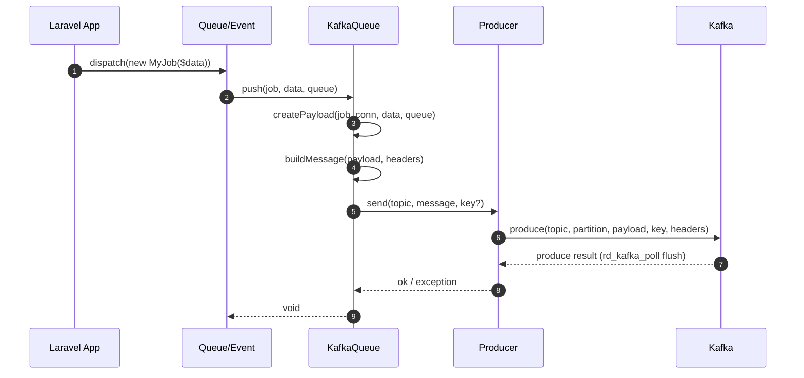
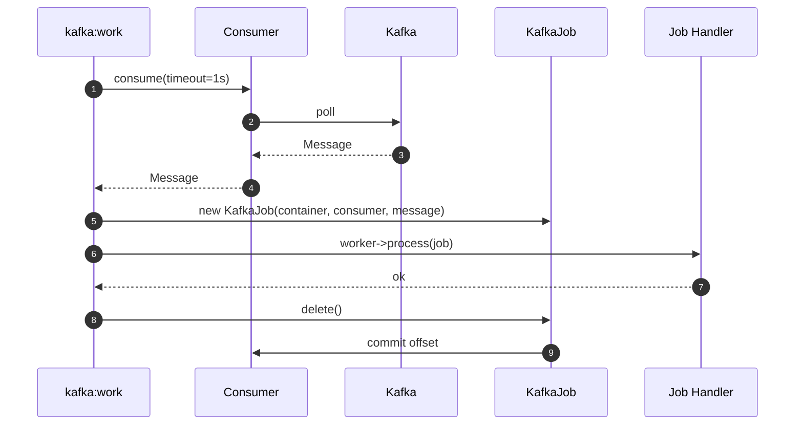
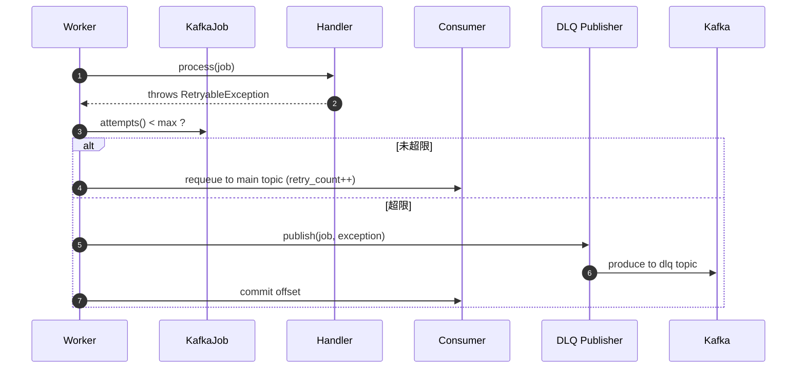

# laravel-kafka 开发文档 v0.1

> 本文档为 **laravel-kafka** 扩展的 v0.1 设计稿。
> 目标读者：扩展作者、Reviewer、二次开发工程师。
> 文档状态：架构冻结前可调整；进入编码后，所有接口变更需走 RFC 流程。

## 0. 决策摘要（v0.1 已锁定）

| 项 | 决议 | 影响范围 |
| --- | --- | --- |
| 包名 | `lyn-huang/laravel-kafka`（Composer 强制小写，GitHub 仓库同） | §2.3 包结构、§1.2 名称、composer.json |
| PHP 最低版本 | **PHP 7.4+** | 全局编码规范、依赖锁定 |
| `ext-rdkafka` | **强制依赖**（`composer.json` 用 `ext-rdkafka` 强约束） | §2.2 依赖、§9 测试矩阵 |
| 失败存储 | **三模式可配**：`database` / `dlq` / `hybrid`（默认 hybrid） | §3.6、§6 配置、§10 路线图 |
| Horizon 适配 | **v0.1 ~ v0.3 不做**，v0.4 重新评估 | §10 路线图 |
| Laravel Octane 兼容 | **v0.1 ~ v0.3 不做**，v0.4 重新评估 | §10 路线图 |
| 失败任务查询 UI | **v0.1 不做**，仅命令行 + DLQ topic 独立消费 | §10 路线图 |
| License | **MIT** | §15 项目元信息、composer.json |
| CI 矩阵 | **PHP 7.4 / 8.1 / 8.3** 三个代表版本 | §9 测试策略、.github/workflows |
| GitHub 仓库可见性 | **先私有** | §15 项目元信息、composer 安装方式 |

PHP 7.4+ 决定意味着 **不能**使用以下语法：enum、match、readonly、构造函数属性提升、命名参数、first-class callable、`true`/`false`/`null` 独立类型。请见 §14 编码规范。

---

## 1. 项目概述

### 1.1 名称

`laravel-kafka`（Composer 包名暂定 `your-org/laravel-kafka`，最终在发布时确认）。

### 1.2 一句话定义

一个把 Apache Kafka 接入 Laravel 队列与事件总线的 Composer 扩展。**基础能力**是把 Kafka 作为 `queue` 驱动的即插即用替代品，**扩展能力**是利用 Kafka 自身特性（分区、消费者组、可重放、事务、Header）补齐 Laravel 队列在分布式场景下的短板。

**包名（已锁定）**：`lyn-huang/laravel-kafka`（Composer 命名空间强制小写）。GitHub 仓库建议同步命名为 `laravel-kafka`，与本项目对应。

### 1.3 解决的问题

| 场景 | 现有方案的痛点 | laravel-kafka 提供的解法 |
| --- | --- | --- |
| 高并发下单/秒杀等任务洪峰 | Redis 队列在单机内存吃紧，水平扩展时易丢消息 | Kafka 分区水平扩展 + 副本 + 持久化日志 |
| 跨服务、跨语言订阅同一事件 | Laravel 事件总线是进程内 / Redis pub/sub，跨语言不友好 | Kafka topic 多订阅者（多 consumer group fan-out） |
| 任务需要**严格顺序** | 数据库/Redis 队列无全局顺序保证 | Kafka 同分区有序（按 key 路由） |
| 出问题需要**重放历史任务** | 传统队列消费即删除，无法回溯 | Kafka 按 offset / 时间戳回放 |
| 多次重试后需要**死信隔离** | Laravel `failed_jobs` 是单表，排查不友好 | 独立 DLQ topic 独立消费、独立告警 |
| 多 Job 必须**原子提交** | 现有队列无跨 Job 事务 | Kafka 事务消息 + 幂等生产者 |

### 1.4 不适用场景（明确边界）

- **极低延迟请求-响应**：Kafka 一次写入通常 5–20ms，Redis Streams / 内存队列更合适。
- **无 Kafka 集群的中小项目**：本包以 Kafka 为中心，引入 Kafka 集群的运维成本本身就是门槛。
- **多语言异构消费 + 严格 schema 演进**：建议直接走 Kafka + Schema Registry + 后端服务，不强行走 Laravel 队列语义。

### 1.5 非目标（v0.1 范围外）

- 集成 **kafka-streams** 之类的 JVM 流处理（PHP 侧做不做价值不大）。
- 提供 **Kafka Connect** 风格的通用 sink/source。
- 完整 **Schema Registry** 客户端（仅留接口位，不在 v0.1 实现）。

---

## 2. 整体架构

### 2.1 分层视图

```
┌────────────────────────────────────────────────────────────┐
│                  Laravel Application                       │
│  ┌──────────────┐  ┌──────────────┐  ┌──────────────┐    │
│  │ Job / Event  │  │ Artisan CLI  │  │ Worker Daemon│    │
│  └──────┬───────┘  └──────┬───────┘  └──────┬───────┘    │
│         │                 │                 │             │
│         ▼                 ▼                 ▼             │
│  ┌─────────────────────────────────────────────────────┐  │
│  │  Illuminate\Contracts\Queue\* (标准接口)             │  │
│  └─────────────────────┬───────────────────────────────┘  │
└────────────────────────┼───────────────────────────────────┘
                         │
                         ▼
┌────────────────────────────────────────────────────────────┐
│                  laravel-kafka package                     │
│  ┌──────────┐  ┌──────────┐  ┌──────────┐  ┌──────────┐   │
│  │ Service  │  │  Queue   │  │  Kafka   │  │  Kafka   │   │
│  │ Provider │  │ Connector│  │  Queue   │  │   Job    │   │
│  └────┬─────┘  └────┬─────┘  └────┬─────┘  └────┬─────┘   │
│       │             │             │             │          │
│  ┌────┴─────────────┴─────────────┴─────────────┴────┐    │
│  │            Manager / ProducerFactory               │    │
│  └────────────────────┬───────────────────────────────┘    │
│  ┌────────────────────┴───────────────────────────────┐    │
│  │        Connector\PhpRdKafkaDriver (librdkafka)     │    │
│  └────────────────────┬───────────────────────────────┘    │
└────────────────────────┼───────────────────────────────────┘
                         │
                         ▼
                  ┌──────────────┐
                  │  Kafka 集群  │
                  │ (KRaft/ZK)   │
                  └──────────────┘
```

### 2.2 关键依赖

| 依赖 | 类型 | 版本约束 | 选型理由 |
| --- | --- | --- | --- |
| **PHP** | 运行时 | `>=7.4` | 用户决议：兼容老项目 |
| `ext-rdkafka` | 扩展 | `*`（建议 `>=4.0`） | 用户决议：强制依赖。librdkafka 官方 PHP 绑定，性能/可靠性/特性覆盖最全 |
| `ext-json` | 扩展 | `*` | 序列化、Header 编码必备（PHP 8.0+ 内置，7.4 需声明） |
| `illuminate/queue` | Composer | `^8.0 \|\| ^9.0 \|\| ^10.0 \|\| ^11.0` | Laravel 队列契约宿主，覆盖主流 LTS / 当前版 |
| `illuminate/support` | Composer | 同上 | 容器、配置、Str 工具 |
| `nesbot/carbon` | Composer | `^2.0 \|\| ^3.0` | 时间戳、延迟时间换算 |
| `ramsey/uuid` | Composer | `^4.0` | trace_id 生成 |
| `symfony/uid` | Composer | — | **不引入**，避免重复依赖 |
| `vlucas/phpdotenv` | 间接 | — | Laravel 自带 |

**版本约束设计要点**：

- `illuminate/*` 跨度 `^8.0` 到 `^11.0`：Laravel 8 要求 PHP ≥ 7.3，恰好覆盖 PHP 7.4 用户。Laravel 8 在 7.4 仍能跑，9+ 需 PHP 8.0+。**但本包目标是 7.4+**，意味着使用 Laravel 9+ 时 PHP 也会被抬到 8.0+，这点用户自行权衡。
- `nesbot/carbon` 跨度 `^2 || ^3`：Carbon 3 要求 PHP 8.1+；当用户 PHP 是 7.4 时 Composer 会自动选 Carbon 2。
- `ext-rdkafka` 不锁版本上限，避免与宿主 librdkafka 冲突。

> **不选择 pure-PHP Kafka 客户端**（如 `superbalist/php-pubsub-kafka`）。原因：(1) librdkafka 是事实标准；(2) 事务、幂等、Consumer Group 协议等复杂行为自己实现风险高；(3) php-rdkafka 由 Confluent 维护。

### 2.3 包结构

```
src/
├── LaravelKafkaServiceProvider.php
├── Manager/
│   ├── KafkaManager.php
│   └── ConnectionFactory.php
├── Queue/
│   ├── KafkaQueue.php                # implements Illuminate\Contracts\Queue\Queue
│   ├── KafkaJob.php                  # implements Illuminate\Contracts\Queue\Job
│   ├── KafkaConnector.php            # implements Illuminate\Queue\Connectors\Connector
│   └── Failed/
│       └── KafkaFailedJobProvider.php
├── Producer/
│   ├── Producer.php
│   ├── ProducerFactory.php
│   ├── Message.php                   # 值对象
│   └── Serializer/
│       ├── Serializer.php
│       ├── PhpSerializer.php         # 默认（与 Laravel 默认一致）
│       └── JsonSerializer.php
├── Consumer/
│   ├── Consumer.php
│   ├── ConsumerFactory.php
│   ├── Subscription.php
│   └── Handler/
│       ├── HandlerResolver.php
│       └── NativeHandler.php         # 处理 Laravel Job
├── Transaction/
│   ├── TransactionalProducer.php     # v0.3
│   └── Idempotency/
│       └── ProducerIdCache.php       # v0.3
├── Dlq/
│   ├── DeadLetterPublisher.php       # v0.2
│   └── DlqPolicy.php
├── Delay/
│   └── DelayRouter.php               # v0.2
├── Replay/
│   └── Replayer.php                  # v0.2
├── Config/
│   └── KafkaConfig.php
├── Support/
│   ├── Header.php
│   ├── TraceContext.php
│   └── Str.php
└── Exceptions/
    ├── KafkaException.php
    ├── SerializationException.php
    └── DlqException.php

config/
└── kafka.php                         # publish 后生成

tests/
├── Unit/
├── Feature/
└── Integration/                      # 用 Testcontainers 起 Kafka
```

---

## 3. 基础功能设计（v0.1 必须）

### 3.1 ServiceProvider

`LaravelKafkaServiceProvider` 负责：

1. `mergeConfigFrom(__DIR__ . '/../config/kafka.php', 'kafka')`
2. 注册 `KafkaManager`（单例）到容器，绑定名 `kafka.manager`。
3. 注册 `queue.connector.kafka` 关联 `KafkaConnector`。
4. 注册 `queue.failer.kafka` 关联 `KafkaFailedJobProvider`（可选，详见 §3.6）。
5. 暴露 Facade（可选）`Kafka` 指向 `KafkaManager`。
6. 发布配置：`php artisan vendor:publish --tag=kafka-config`。
7. 注册 Artisan 命令 `kafka:work`、`kafka:replay`、`kafka:dlq:tail`（v0.2+ 才有部分命令）。

### 3.2 Connector

```php
namespace LaravelKafka\Queue;

use Illuminate\Queue\Connectors\Connector;

class KafkaConnector implements Connector
{
    public function connect(array $config): \Illuminate\Contracts\Queue\Queue
    {
        $manager = app('kafka.manager');
        return $manager->connection($config['name'] ?? 'default');
    }
}
```

`config/queue.php` 接入：

```php
'connections' => [
    'kafka' => [
        'driver'    => 'kafka',
        'name'      => 'default',
        'brokers'   => env('KAFKA_BROKERS', 'localhost:9092'),
        'queue'     => env('KAFKA_DEFAULT_TOPIC', 'laravel-jobs'),
        // 其余配置见 §6
    ],
],
```

### 3.3 Queue 实现

```php
namespace LaravelKafka\Queue;

use Illuminate\Contracts\Queue\Queue as LaravelQueue;
use Illuminate\Queue\Queue;
use LaravelKafka\Producer\Producer;
use LaravelKafka\Support\Header;

class KafkaQueue extends Queue implements LaravelQueue
{
    public function __construct(
        private Producer $producer,
        private string $defaultTopic,
        private array $config,
    ) {}

    public function size($queue = null): int
    {
        // v0.1 通过 GetOffset 返回 high-water-mark 与 committed 估算
        // 不要求强一致，给出 best-effort
    }

    public function push($job, $data = '', $queue = null)
    {
        return $this->pushRaw($this->createPayload($job, $this->connectionName, $data, $queue), $queue, []);
    }

    public function pushRaw($payload, $queue = null, array $options = [])
    {
        $topic   = $this->resolveTopic($queue);
        $message = $this->buildMessage($payload, $options, $queue);
        return $this->producer->send($topic, $message);
    }

    public function later($delay, $job, $data = '', $queue = null)
    {
        // v0.1：直接写入，等待消费者 sleep 调度（见 §4.5 DelayRouter）
        // v0.2：走时间轮分层 topic
        return $this->pushRaw(
            $this->createPayload($job, $this->connectionName, $data, $queue),
            $queue,
            ['delay_seconds' => max(0, (int) $delay)]
        );
    }

    public function pop($queue = null) { /* 消费由 Worker 驱动，见 §3.5 */ }

    private function resolveTopic(?string $queue): string
    {
        return $this->config['topics'][$queue] ?? $queue ?? $this->defaultTopic;
    }

    private function buildMessage(string $payload, array $options, ?string $queue): Message
    {
        $headers = [
            Header::TRACE_ID     => (string) Str::uuid(),
            Header::QUEUE        => (string) ($queue ?? $this->defaultTopic),
            Header::CONNECTION   => $this->connectionName,
            Header::ENQUEUED_AT  => (string) (int) (microtime(true) * 1000),
            Header::RETRY_COUNT  => '0',
        ];
        if (isset($options['delay_seconds'])) {
            $headers[Header::AVAILABLE_AT] = (string) ((int) (microtime(true) * 1000) + $options['delay_seconds'] * 1000);
        }
        return new Message($payload, headers: $headers);
    }
}
```

**关键约束**：

- **必须沿用 `Illuminate\Queue\Queue` 基类**：继承 `createPayload` / `createPayloadArray` / `createPayloadString` 等公共方法，保证 `Job::class`、`Command::class`、字符串 handler 都能识别。
- `connectionName` 通过构造函数注入：基类 `Queue::__construct` 已支持。
- **不要重写 `setContainer` 等基类行为**。

### 3.4 Job 包装

```php
namespace LaravelKafka\Queue;

use Illuminate\Contracts\Queue\Job as JobContract;
use Illuminate\Queue\Jobs\Job;
use LaravelKafka\Consumer\Consumer;

class KafkaJob extends Job implements JobContract
{
    public function __construct(
        Container $container,
        protected Consumer $consumer,
        protected \RdKafka\Message $message,
        string $connectionName,
        string $queue,
    ) {
        parent::__construct($container, $connectionName, $queue, '');
    }

    public function getJobId(): ?string
    {
        return $this->message->headers[Header::JOB_ID] ?? (string) $this->message->offset;
    }

    public function getRawBody(): string
    {
        return (string) $this->message->payload;
    }

    public function attempts(): int
    {
        return (int) ($this->message->headers[Header::RETRY_COUNT] ?? 0) + 1;
    }

    public function release($delay = 0)
    {
        parent::release($delay);
        // 不在此处发送：Worker 会处理
    }

    public function delete()
    {
        parent::delete();
        $this->consumer->ack($this->message);
    }

    public function fail($exception)
    {
        // 写入 failed_jobs 或 DLQ topic
    }
}
```

### 3.5 Worker / Consumer 循环

`kafka:work` 命令启动一个长驻进程，结构：

```php
while (! $shouldQuit) {
    $message = $consumer->consume(timeoutMs: 1000);

    if ($message === null) continue;

    if ($delayActive = $message->headers[Header::AVAILABLE_AT] ?? null) {
        if ((int) $delayActive > (int) (microtime(true) * 1000)) {
            $consumer->ack($message);     // 重新入队到 DelayRouter
            continue;
        }
    }

    $job = new KafkaJob($container, $consumer, $message, $name, $queue);
    $worker = app('queue.worker')->setName($name);

    try {
        $worker->process($connectionName, $job, $this->maxAttempts);
    } catch (Throwable $e) {
        $job->fail($e);
    }
}
```

**信号处理**：

- `SIGTERM` / `SIGINT` 触发优雅退出：处理完当前 message，再提交 offset，最后退出。
- `SIGQUIT` 强制退出（不提交 offset，下次重新消费）。

**Consume 循环约束**：

- `consume()` 必须设短超时（≤ 1s）以便及时响应信号。
- 关闭 `auto.offset.reset` 为 `error` —— 没有 committed offset 时直接报错，避免意外从头消费。
- 默认 `enable.auto.commit = false`，由 Worker 在 `Job::delete()` 后手动提交。

### 3.6 失败处理（v0.1 三模式可配）

Laravel 的 `failed_jobs` 表只支持单一驱动，本扩展把失败处理从"驱动"提升为"模式"，三种模式通过 `config/kafka.php` 切换：

| 模式 | `failed.driver` 值 | 行为 | 适用 |
| --- | --- | --- | --- |
| **database** | `database` | 失败全部写 `failed_jobs` 表，DLQ topic 不写 | 沿用 Laravel 习惯，依赖 SQL 查询排查 |
| **dlq** | `dlq` | 失败全部写 DLQ topic，`failed_jobs` 表不写 | 纯 Kafka 生态，跨语言消费失败任务 |
| **hybrid**（推荐 / 默认） | `hybrid` | 见下文混合策略 | 既要 SQL 可查，又要 Kafka 生态可消费 |

#### 3.6.1 Hybrid 模式策略

```
触发失败
   │
   ▼
attempts < maxAttempts
   ├─ 是 → release 回主 topic（不写入任何失败存储）
   └─ 否 → 致命异常（SerializationException / ValidationException / 黑名单 exception_class）？
              ├─ 是 → 立即 DLQ（跳过 maxAttempts）
              └─ 否 → 同时写 failed_jobs 表 + DLQ topic
```

#### 3.6.2 接口

```php
namespace LaravelKafka\Queue\Failed;

interface FailedJobHandler
{
    public function handle(KafkaJob $job, Throwable $e, FailedContext $ctx): void;
}
```

三个实现：

- `DatabaseFailedJobHandler`（写 `failed_jobs` 表，复用 `Illuminate\Queue\Failed\DatabaseUuidFailedJobProvider`）
- `DlqFailedJobHandler`（写 DLQ topic）
- `HybridFailedJobHandler`（包上面两个 + 决策树）

`ServiceProvider` 启动时根据 `config('kafka.connections.default.failed.driver')` 绑定具体 handler。

#### 3.6.3 DLQ Topic 规范

DLQ topic 名规则：`<original-topic>.dlq`（用户可在 `dlq.topic` 显式指定覆盖）。

DLQ 消息额外 Header：

| Header | 含义 |
| --- | --- |
| `x-original-topic` | 源 topic |
| `x-original-partition` | 源分区 |
| `x-original-offset` | 源 offset |
| `x-original-headers` | 原始 Header 的 JSON 序列化 |
| `x-failed-at` | 失败时间 ms |
| `x-exception-class` | 异常类名 |
| `x-exception-message` | 异常 message（截断 4KB） |
| `x-exception-trace` | 异常 trace（截断 32KB） |
| `x-attempts` | 累计重试次数 |

Payload：与原消息完全相同，不重新序列化。

#### 3.6.4 与 Laravel `failed_jobs` 表的关系

- `database` / `hybrid` 模式时，注册 `queue.failer.kafka` 到 Laravel 容器，让 `php artisan queue:failed`、`queue:retry`、`queue:flush` 命令仍可用。
- DLQ topic 是一条独立数据流，不被 `queue:retry` 命令读取。**重放 DLQ 任务** 用 `php artisan kafka:replay`（v0.2）或独立 consumer。

---

## 4. 扩展功能设计（v0.2+）

下表中所有功能按"先设计、后实现"原则进入版本路线图，详见 §10。

### 4.1 多 Topic 路由（v0.2）

```php
// config/kafka.php
'topics' => [
    'default'        => 'laravel-jobs',
    'emails'         => 'app.emails',
    'reports'        => 'app.reports',
    'critical'       => 'app.critical',     // 顺序保证 topic
],
```

`KafkaQueue::pushRaw` 通过 `resolveTopic($queue)` 把 Laravel 的逻辑队列名映射到 Kafka topic 名，做到 **业务队列名与物理 topic 解耦**。

支持的能力：

- 业务方改队列名不用动 topic 名（灰度切流）
- 同一 Job 可以推到不同 topic（按业务线 / 优先级 / 合规域隔离）
- 消费端可以订阅 topic 集合，按 consumer group 隔离

### 4.2 Consumer Group 水平扩展（v0.1 已支持，靠 Kafka 自身）

Laravel 队列 worker 多进程受限于单 Redis 队列 ack 抖动；Kafka 通过 **consumer group + 分区** 天然支持：

```
            ┌───────────────┐
            │  topic A      │
            │  8 partitions │
            └──────┬────────┘
                   │
      ┌────────────┼────────────┐
      │            │            │
┌─────┴────┐ ┌─────┴────┐ ┌─────┴────┐
│ worker-1 │ │ worker-2 │ │ worker-3 │   <- 同一个 group.id
│ p0 p1 p2 │ │ p3 p4 p5 │ │ p6 p7    │
└──────────┘ └──────────┘ └──────────┘
```

扩缩容时 Kafka 触发 rebalance，partition 在 worker 间再分配。**注意 PHP 进程模型**：每次 `kafka:work` 命令是一个 worker，水平扩展就是开多个进程 / 多机。

### 4.3 Key Routing：分区顺序保证（v0.2）

Kafka 单分区内严格有序。**用法**：

```php
$queue->push(
    new ProcessOrder($orderId),
    payload: $orderId,                                  // 数据
    queue:   'orders',
    key:     (string) $orderId,                         // 路由键
);
```

内部：

```php
$producer->send($topic, $message, key: (string) $key);
```

rdkafka 默认 `partitioner.murmur2_random`，指定 key 后同一 key 永远落同一分区。Laravel 层 API 透出：

- `KafkaQueue::push($job, $data, $queue, ?string $key = null)` 第四参数
- `Bus::dispatch($job)->withKafkaKey((string) $id)` 链式调用（v0.2 增强）

### 4.4 多 Consumer Group Fan-out（v0.3）

同一份消息被多个独立业务方消费（订单事件同时被「库存」「账务」「BI」消费）。

```php
$producer->send($topic, $message, groups: [
    'inventory' => ['group.id' => 'inventory-svc'],
    'billing'   => ['group.id' => 'billing-svc'],
]);
```

实现要点：

- `Producer` 不感知 group；group 在 `Consumer` 端配置
- 提供 `Kafka::subscribe($topic, $handler, group: 'billing-svc')` 公共 API
- 与 Laravel 事件解耦：订阅者可以不是 Job 类，而是一个回调 / invokable

### 4.5 延迟消息 / 计划任务（v0.2）

Kafka **不**原生支持延迟消息。两种实现路径：

**方案 A：时间轮分层 topic**（推荐，简单）

```
delay.5s   delay.30s  delay.1m  delay.5m  delay.1h  delay.1d
```

- 生产时根据 `delay_seconds` 选最近一档 topic
- 消费者拉到后判断是否到期，未到期则 `produce` 到下一档（递归到 5s 档最终消费）
- 时间分辨率由「档数 × 后台调度频率」决定

**方案 B：基于 OffsetSpec / 时间戳回放**（备选）

- 把可用时间写到 message header
- Worker 拉取后若未到期 `pause + seek`，轮询再处理
- 实现简单但占 partition 资源

**v0.2 选 A 为主，B 为辅助**。详见 `DelayRouter` 设计（v0.2 启动时再细化）。

### 4.6 死信队列 DLQ（v0.2）

```php
// config/kafka.php
'dlq' => [
    'enabled'   => true,
    'topic'     => 'laravel-jobs.dlq',
    'retention' => 14 * 24 * 3600 * 1000,    // ms, 14 天
    'policy'    => 'after_max_attempts',       // after_max_attempts | on_exception
],
```

**流程**：

```
push  ──►  main topic
              │
              ▼
        consumer.work
        ├─ 成功 → ack offset
        ├─ 业务异常 + 未超限 → retry（requeue 到 main）
        └─ 业务异常 + 超限 → publish to dlq + ack offset
              │
              ▼
       dlq topic ──► 独立 consumer / 告警 / 人肉排查
```

Header 透传：`original_topic`、`original_partition`、`original_offset`、`exception_class`、`exception_message`、`attempts`、`first_failed_at`。

### 4.7 事务与幂等（v0.3）

**目标**：跨 topic / 跨分区的 **exactly-once 语义**。

```php
DB::transaction(function () use ($order) {
    $order->save();
    Kafka::transaction(function ($producer) use ($order) {
        $producer->send('orders.created', new OrderCreated($order));
        $producer->send('inventory.deduct', new DeductStock($order));
    });
});
```

要求：

- Kafka broker 启用事务（`transaction.state.log.replication.factor >= 3`）
- Producer 配置 `enable.idempotence=true`、`transactional.id=uniq-per-instance`
- 消费端用 `read_committed` 隔离级别，只读已提交消息
- 与 Laravel 业务 DB 事务协同：业务事务先 commit，再 commit Kafka 事务（**不能反向**）

### 4.8 消息回溯 / Replay（v0.2）

```bash
# 把 topic 过去 1 小时的 messages 重新推到主队列
php artisan kafka:replay \
    --topic=orders.events \
    --from=-1h \
    --to=now \
    --target-topic=orders.events.replay \
    --group=replay-runner
```

底层用 `RdKafka\KafkaConsumer::queryWatermarkOffsets` + `seek` 实现。

### 4.9 Header 透传 & Trace（v0.2）

默认在每条 message 写入：

| Header key | 说明 |
| --- | --- |
| `x-trace-id` | UUID v4，首次入队时生成 |
| `x-tenant-id` | 来自当前请求上下文（可选） |
| `x-enqueued-at` | 入队时间 ms |
| `x-available-at` | 延迟时间到期 ms |
| `x-attempt` | 当前重试次数 |
| `x-queue` | Laravel 逻辑队列名 |
| `x-connection` | Laravel queue connection |

提供 `Job::header('x-trace-id')` API 在 handler 内读取。

### 4.10 批量消费（v0.2）

`kafka:work` 增加 `--batch-size=50 --batch-timeout=2000`：

```php
$messages = $consumer->consumeBatch($size, $timeoutMs);
foreach ($messages as $msg) {
    $job = $this->toJob($msg);
    $worker->process($job);
}
```

要求 handler 内部做好并发安全，或保持串行（默认）。批量模式下 offset 提交要等整批处理完。

### 4.11 Schema 演进（v0.4）

留 `Serializer` 接口位：

```php
interface Serializer {
    public function encode(mixed $value): string;
    public function decode(string $raw): mixed;
}
```

v0.1 默认 `PhpSerializer`（与 Laravel 同源），v0.4 增加 `JsonSerializer`、`AvroSerializer`（需要 librdkafka schema 支持）。

---

## 5. 关键流程时序图

### 5.1 生产流程



### 5.2 消费流程



### 5.3 重试与 DLQ 流程



---

## 6. 配置项

`config/kafka.php` 完整字段：

```php
return [

    'default' => env('KAFKA_CONNECTION', 'default'),

    'connections' => [

        'default' => [

            // 基础
            'brokers'          => env('KAFKA_BROKERS', 'localhost:9092'),
            'client_id'        => env('KAFKA_CLIENT_ID', 'laravel-kafka'),
            'protocol'         => env('KAFKA_PROTOCOL', 'PLAINTEXT'),    // PLAINTEXT | SSL | SASL_PLAINTEXT | SASL_SSL
            'sasl'             => [
                'mechanism' => env('KAFKA_SASL_MECHANISM'),               // PLAIN | SCRAM-SHA-256 | SCRAM-SHA-512
                'username'  => env('KAFKA_SASL_USERNAME'),
                'password'  => env('KAFKA_SASL_PASSWORD'),
            ],
            'ssl'              => [
                'ca_location'   => env('KAFKA_SSL_CA'),
                'cert_location' => env('KAFKA_SSL_CERT'),
                'key_location'  => env('KAFKA_SSL_KEY'),
            ],

            // 队列语义
            'queue'            => env('KAFKA_DEFAULT_TOPIC', 'laravel-jobs'),
            'topics'           => [
                // 'emails' => 'app.emails',
            ],

            // 生产者
            'producer' => [
                'compression'        => 'snappy',                           // none | gzip | snappy | lz4 | zstd
                'batch_size'         => 10000,                              // bytes
                'linger_ms'          => 5,
                'request_timeout_ms' => 30000,
                'message_timeout_ms' => 30000,
                'enable_idempotence' => true,
                'acks'               => 'all',
            ],

            // 消费者 / Worker
            'consumer' => [
                'group_id'              => env('KAFKA_GROUP_ID', 'laravel-default'),
                'auto_offset_reset'     => 'error',                          // earliest | latest | error
                'enable_auto_commit'    => false,
                'max_poll_interval_ms'  => 300000,
                'session_timeout_ms'    => 45000,
                'heartbeat_interval_ms' => 3000,
                'fetch_min_bytes'       => 1,
                'fetch_max_bytes'       => 52428800,                         // 50MB
                'isolation_level'       => 'read_committed',                 // read_uncommitted | read_committed
            ],

            // 失败处理（v0.1 三模式可配）
            'failed' => [
                // database | dlq | hybrid
                'driver'   => env('KAFKA_FAILED_DRIVER', 'hybrid'),

                // database / hybrid 模式专用
                'database' => [
                    'table'      => 'failed_jobs',
                    'connection' => env('DB_FAILED_CONNECTION'),             // null=default
                ],

                // dlq / hybrid 模式专用
                'dlq' => [
                    'topic'             => env('KAFKA_DLQ_TOPIC'),          // null → 自动拼接 <original>.dlq
                    'auto_topic_suffix' => '.dlq',                           // 当 dlq.topic 为空时
                    'retention_ms'      => 1209600000,                       // 14d, 落到 topic 创建参数
                ],

                // hybrid 模式策略
                'hybrid' => [
                    'fatal_exceptions' => [                                  // 跳过重试直接 DLQ
                        \LaravelKafka\Exceptions\SerializationException::class,
                        \Illuminate\Validation\ValidationException::class,
                    ],
                    'max_attempts'     => env('KAFKA_MAX_ATTEMPTS', 3),      // 全部模式通用
                    'trace_truncate_bytes' => 32768,                          // 异常 trace 截断
                    'message_truncate_bytes' => 4096,
                ],
            ],

            // 扩展
            'delay' => [
                'strategy' => 'time_wheel',                                 // time_wheel | requeue
                'tiers'    => [5, 30, 60, 300, 1800, 3600, 86400],          // seconds
            ],
            'replay' => [
                'preserve_partition' => true,
            ],
        ],

    ],

];
```

---

## 7. 公共 API

```php
// 1) 作为 Queue 驱动使用 —— 与现有 Laravel 代码零差异
Queue::push(new MyJob($data));
dispatch(new MyJob($data));

// 2) Kafka 专属 API（v0.2+）
Kafka::send('topic', $message, key: 'user-42');
Kafka::transaction(function ($producer) { ... });
Kafka::replay(topic: 'x', from: '-1h');
Kafka::dlq()->tail('laravel-jobs.dlq', fn ($msg) => ...);
```

---

## 8. 性能与可靠性

### 8.1 生产端

- `enable_idempotence=true` + `acks=all`：单分区 exactly-once，跨分区需配合事务。
- `compression=snappy`：吞吐与 CPU 折中。
- `linger_ms=5`：积攒小批量，吞吐↑ 延迟↑，默认 5ms 可接受。
- `batch_size=10000`：与 `linger_ms` 配合控制单次请求体积。

### 8.2 消费端

- `enable_auto_commit=false`：手动 commit，避免消息处理失败但已 commit 导致丢失。
- **at-least-once**：业务侧需要幂等（`attempts()` 计数 + 业务唯一键去重）。
- `isolation_level=read_committed`：配合生产者事务，过滤未提交消息。
- `session_timeout_ms` 与 `max_poll_interval_ms`：超出会触发 rebalance，单条消息处理上限建议 ≤ 5min。

### 8.3 优雅停机

- 监听 SIGTERM：在当前 message 处理完后 commit offset 并退出。
- 监听 SIGINT：同上（Ctrl+C）。
- 监听 SIGHUP（可选）：重新加载配置。

### 8.4 错误分类

| 错误 | 处理 |
| --- | --- |
| 网络抖动 | Producer 内部重试（`retries=10`, `retry.backoff.ms=100`） |
| 序列化失败 | 直接进 DLQ（重试无意义） |
| 业务异常 | 走 §3.6 失败流程 + 重试 |
| 消费者 rebalance | 中断当前循环，重新分配 partition |
| 致命配置错误 | 进程退出，supervisor 重启 |

---

## 9. 测试策略

### 9.1 单元测试

- `KafkaQueue` 各方法的入参 / 序列化逻辑（mock Producer）
- `KafkaJob` 字段映射
- `Header` / `Message` 值对象
- `Serializer` 编码解码

### 9.2 Feature / 集成测试

- 端到端：push → consume → 业务执行 → ack
- 失败重试 → DLQ
- 延迟消息：5s 档按时出队
- 优雅停机：SIGTERM 后 offset 正确
- 多消费者竞争：3 worker × 8 partition，按 key 路由稳定

### 9.3 集成环境

- **首选**：Testcontainers（`testcontainers/testcontainers-php` 或 `docker-php`）启动 `confluentinc/cp-kafka` 容器。
- **回退**：GitHub Actions 跑 KRaft 单节点 `bitnami/kafka`。
- 不依赖任何外部 Kafka 集群（CI 不可外连）。

### 9.4 性能压测

- 同等 8 核 16G 机，对比 Redis 队列：单分区 1k msg/s、8 分区 ≥ 6k msg/s。
- 长任务（sleep 30s）+ 短任务混合：consumer lag 走势、rebalance 频率。

### 9.5 CI 矩阵（v0.1 锁定）

按用户决议，**只测三个代表 PHP 版本**，理由：

- **PHP 7.4**：用户决议的下限，必须跑通
- **PHP 8.1**：当前 Composer 生态主流版本（大量包最低要求），同时验证 Carbon 3 路径
- **PHP 8.3**：当前稳定版，验证新特性兼容（如 typed constants、readonly class 等未来可选项）

**不测 8.0 / 8.2 的理由**：8.0 与 8.1 行为差异极小，8.2 与 8.3 行为差异极小，三个版本已能覆盖关键行为路径。

```yaml
# .github/workflows/tests.yml
strategy:
  matrix:
    php: ['7.4', '8.1', '8.3']
    laravel: ['8.*', '9.*', '10.*', '11.*']
    exclude:
      # Laravel 11+ 要求 PHP 8.2+，PHP 7.4 跑不了
      - php: '7.4'
        laravel: '11.*'
      # Laravel 9 / 10 都要 PHP 8.0+，PHP 7.4 只能跑 Laravel 8
      - php: '7.4'
        laravel: '9.*'
      - php: '7.4'
        laravel: '10.*'
include:
  - php: '7.4'
    laravel: '8.*'
  - php: '8.1'
    laravel: ['9.*', '10.*', '11.*']
  - php: '8.3'
    laravel: ['10.*', '11.*']
```

矩阵共 7 个组合：
- 7.4 + Laravel 8
- 8.1 + Laravel 9
- 8.1 + Laravel 10
- 8.1 + Laravel 11
- 8.3 + Laravel 10
- 8.3 + Laravel 11
- （+linter 单独跑）

Linter（php-cs-fixer + phpstan）独立 job，不依赖 PHP 版本。

### 9.6 ext-rdkafka 在 CI 中的安装

```yaml
- name: Install librdkafka
  run: |
    sudo apt-get update
    sudo apt-get install -y librdkafka-dev
- name: Install php-rdkafka
  run: pecl install rdkafka
```

GitHub Actions 的 `shivammathur/setup-php` action 内置 `rdkafka` 支持，可直接 `setup-php -P rdkafka`。

---

## 10. 版本路线图

| 版本 | 目标 | 关键交付 |
| --- | --- | --- |
| **v0.1** | Laravel 队列可替换 | ServiceProvider、Connector、Queue、Job、Consumer Loop、**Failed（database / dlq / hybrid 三模式可配）**、PHP 7.4 兼容基线、Testcontainers 集成测试 |
| **v0.2** | 扩展功能 MVP | 多 Topic 路由、Key Routing、DLQ 高级特性、延迟（时间轮）、Header Trace、批量消费、Replay |
| **v0.3** | 高级能力 | 事务、幂等、多 Consumer Group Fan-out、Read-Committed |
| **v0.4** | 生态对齐 | Schema Registry 客户端、OpenTelemetry 集成、Horizon 适配 |
| **v0.5** | 稳定性 | 性能压测、压测报告、生产案例 |

每个版本发布前必须：

1. 覆盖率 ≥ 80%（v0.1 允许 60%）
2. `tests/Integration` 在 CI 中跑过
3. 文档同步更新（本文件 + README + 迁移指南）
4. CHANGELOG 注明 BREAKING CHANGE

---

## 11. 决策记录

### 11.1 v0.1 锁定决议

| # | 议题 | 决议 | 备注 |
| --- | --- | --- | --- |
| 1 | 包名 | `lyn-huang/laravel-kafka` | Composer 强制小写 |
| 2 | PHP 版本下限 | 7.4+ | 见 §14 编码规范 |
| 3 | `ext-rdkafka` | 强制依赖 | composer.json 强约束 |
| 4 | 失败存储 | database / dlq / hybrid 三模式可配，默认 hybrid | 见 §3.6 |
| 5 | Horizon 适配 | **v0.1 ~ v0.3 不做**，v0.4 重新评估 | 资源聚焦核心队列 |
| 6 | Laravel Octane 兼容 | **v0.1 ~ v0.3 不做**，v0.4 重新评估 | 长期连接管理复杂度高 |
| 7 | 失败任务查询 UI | **v0.1 不做** | 仅 `queue:failed` 命令 + DLQ topic 独立消费 |
| 8 | License | **MIT** | 与 Laravel 生态对齐 |
| 9 | CI 矩阵 | **PHP 7.4 / 8.1 / 8.3** | 见 §9.5 |
| 10 | GitHub 仓库可见性 | **先私有** | 见 §15 |

### 11.2 后续 RFC 议题（v0.2+ 启动时新开 RFC）

- Horizon 适配方案（v0.4）
- Octane 长连接生命周期管理（v0.4）
- 是否提供 Web UI / Telescope 集成（v0.4+）
- 仓库转公开的时机评估（v0.5 / v1.0）

---

## 12. 附录

### 12.1 与 Laravel 默认 Redis 队列的差异

| 维度 | Redis 队列 | laravel-kafka |
| --- | --- | --- |
| 持久化 | 内存 + AOF/RDB | 磁盘顺序写 |
| 水平扩展 | 共享 Redis 即可 | Consumer Group + 分区 |
| 严格顺序 | 无 | 同分区有序（按 key） |
| 死信 | failed_jobs 表 | 独立 DLQ topic |
| 延迟队列 | `delay_seconds` 字段，worker sleep | 时间轮分层 topic（v0.2） |
| 回溯 | 不可 | 按 offset / 时间戳回放（v0.2） |
| 跨语言消费 | 受限 | Kafka 协议天然多语言 |
| 运维成本 | 低 | 中（需维护 Kafka 集群） |

### 12.2 参考资料

- Laravel Queue 官方文档：<https://laravel.com/docs/queues>
- librdkafka 配置：<https://github.com/confluentinc/librdkafka/blob/master/CONFIGURATION.md>
- Kafka 官方文档：<https://kafka.apache.org/documentation/>
- Confluent PHP 客户端示例：<https://docs.confluent.io/platform/current/clients/librdkafka/html/index.html>
- Kafka Exactly-Once 语义：<https://kafka.apache.org/documentation/#semantics>

---

## 13. PHP 7.4 编码规范（v0.1 强制约束）

PHP 7.4+ 是用户决议的下限，但很多"现代 PHP"语法 8.0+ 才支持。本节列出 **禁止使用** 和 **必须使用** 的语法，避免 PR 时反复拉锯。

### 13.1 禁止使用（PHP 8.0+ 特性）

| 特性 | PHP 版本 | 替代写法 |
| --- | --- | --- |
| `enum` | 8.1+ | 用类常量（`const X = 'x'`） |
| `match` | 8.0+ | `switch` 表达式化（PHP 7.4 不支持 `match` 作为表达式） |
| `readonly` 属性 | 8.1+ | `private` + getter，或在构造器内仅赋值一次 |
| 构造函数属性提升 `public function __construct(public Foo $foo)` | 8.0+ | 显式声明属性 + 赋值 |
| 命名参数 `func(name: $value)` | 8.0+ | 数组传参或新方法重载 |
| `nullsafe` 操作符 `?->` | 8.0+ | `if ($x !== null) { $x->... }` |
| 联合类型 `int\|string` | 8.0+ | 文档注解 `@param int\|string` |
| `true` / `false` / `null` 作为独立类型 | 8.0+ | `bool` 代替 `true`/`false` |
| first-class callable `$fn(...)` | 8.1+ | `Closure::fromCallable($fn)` |
| 注解 `#[Attribute]` | 8.0+ | DocBlock `@annotation` |
| `WeakMap` / `WeakReference` | 8.0+ | 不使用，或用数组 + 显式清理 |
| `str_contains` / `str_starts_with` / `str_ends_with` | 8.0+ | `Str::contains` / 自实现 |

### 13.2 必须使用（PHP 7.4 已支持）

- 类型声明（标量 + 返回类型 + 参数 nullable `?int`）
- `void` 返回类型
- 箭头函数 `fn($x) => $x * 2`（7.4 引入）
- 类型化属性 `private int $count;`（7.4 引入）
- 协变量返回类型（7.4 引入）
- 数组解包 `[...$a, ...$b]`（7.4 改进）

### 13.3 代码风格

- 遵循 **PER Coding Style 2.0**（PSR-12 升级版），Laravel 项目默认风格。
- 缩进：4 空格。
- 行宽：120 字符软上限，硬上限 140。
- `declare(strict_types=1);` **必须** 在每个 PHP 文件顶部声明（Laravel 9+ 项目已默认开启）。
- 类属性顺序：`public` → `protected` → `private`，每组之间空行。
- 常量在类顶部，属性其次，方法最后。

### 13.4 依赖注入与容器

- 构造函数注入为主，**禁止** 静态 `app()` 散布在业务方法中（`LaravelKafkaServiceProvider::boot()` 除外）。
- 容器解析只能在 `ServiceProvider` 或 `Factory` 内进行。

### 13.5 错误处理

- **禁止** `@` 抑制错误。
- 所有 `RdKafka\Producer::produce()` 必须 try-catch，因为底层会抛 `RdKafka\Exception`。
- 所有 Kafka 客户端方法失败时统一抛 `LaravelKafka\Exceptions\KafkaException`，业务层只 catch 这一种。

### 13.6 CI 检查脚本

在 `composer.json` 中配置：

```json
{
    "scripts": {
        "lint": "php-cs-fixer fix --dry-run --diff",
        "lint:fix": "php-cs-fixer fix",
        "static": "phpstan analyse src --level=6",
        "test": "phpunit"
    }
}
```

`phpstan` level 6 是 v0.1 目标（不追求 8/9，留出 7.4 兼容的灵活度）。

### 13.7 PHP 7.4 兼容性的实操陷阱

1. **nullsafe 替代**：判断链式调用每一层是否 null
   ```php
   // 禁止（PHP 8.0+）
   $value = $a?->b?->c;
   // 必须（PHP 7.4）
   $value = null;
   if ($a !== null && $a->b !== null) {
       $value = $a->b->c;
   }
   ```

2. **联合类型改用注解**：
   ```php
   // 禁止（PHP 8.0+）
   public function set(int|string $v): void {}
   // 必须（PHP 7.4）
   /**
    * @param int|string $v
    */
   public function set($v): void {}
   ```

3. **构造函数属性提升替代**：
   ```php
   // 禁止（PHP 8.0+）
   public function __construct(public Producer $p, public array $cfg) {}
   // 必须（PHP 7.4）
   private Producer $p;
   private array $cfg;
   public function __construct(Producer $p, array $cfg)
   {
       $this->p   = $p;
       $this->cfg = $cfg;
   }
   ```

4. **match 替代**：
   ```php
   // 禁止（PHP 8.0+）
   $code = match($status) { 200 => 'ok', 404 => 'nf', default => 'err' };
   // 必须（PHP 7.4）
   switch ($status) {
       case 200: $code = 'ok'; break;
       case 404: $code = 'nf'; break;
       default:  $code = 'err';
   }
   ```

5. **枚举替代**：
   ```php
   // 禁止（PHP 8.1+）
   enum Mode { case Database; case Dlq; case Hybrid; }
   // 必须（PHP 7.4）
   final class FailedDriver
   {
       public const DATABASE = 'database';
       public const DLQ      = 'dlq';
       public const HYBRID   = 'hybrid';
   }
   ```

---

## 14. RFC 决议记录

| RFC | 议题 | 状态 | 日期 | 决议摘要 |
| --- | --- | --- | --- | --- |
| 0001 | 包名 / PHP 版本 / ext-rdkafka / 失败模式 | ✅ Accepted | 2026-08-20 | 见 §11.1 #1~#4 |
| 0002 | Horizon / Octane / UI / License / CI / 仓库可见性 | ✅ Accepted | 2026-08-20 | 见 §11.1 #5~#10，Horizon 与 Octane 推迟到 v0.4，UI 推迟到 v0.4+，License MIT，CI 7.4/8.1/8.3，仓库先私有 |

后续 RFC 编号递增，存放在 `RFC/` 目录，单文件格式：

```markdown
# RFC NNNN - 标题
## 状态
## 摘要
## 详细方案
## 兼容性影响
## 替代方案
## 决策
```

---

## 15. 项目元信息

### 15.1 License

**MIT**（用户决议）。仓库根目录放 `LICENSE` 文件，标准 MIT 模板，Copyright 行：

```
MIT License

Copyright (c) 2026 Lyn-Huang
```

`composer.json` 必填字段：

```json
{
    "license": "MIT"
}
```

### 15.2 GitHub 仓库可见性

**先私有**（用户决议）。

**影响 1：不能直接发布到 Packagist 公共仓库**

私有仓库不能通过 `https://packagist.org/` 自动同步。两种方案：

- **方案 A（v0.1 推荐）**：**不发布 Packagist**，让使用方在自己的 `composer.json` 中配置仓库源：
  ```json
  {
      "repositories": [
          {
              "type": "vcs",
              "url": "https://github.com/Lyn-Huang/laravel-kafka.git"
          }
      ],
      "require": {
          "lyn-huang/laravel-kafka": "dev-main"
      }
  }
  ```
  使用方需在 `~/.composer/auth.json` 中配 GitHub Personal Access Token：
  ```json
  {
      "github-oauth": {
          "github.com": "ghp_xxx"
      }
  }
  ```

- **方案 B（v0.5 评估）**：转公开后再上 Packagist，URL `https://packagist.org/packages/lyn-huang/laravel-kafka`。

**影响 2：CI 中安装依赖**

GitHub Actions 同一 owner 下的私有仓库可免 token 访问（用 `GITHUB_TOKEN`）。跨 owner 需 PAT。

**影响 3：贡献者协作**

私有期只接受显式邀请的协作者。PR 模板可简化（暂不强制贡献指南）。

### 15.3 composer.json 关键字段

```json
{
    "name": "lyn-huang/laravel-kafka",
    "description": "Apache Kafka Queue driver & event bus for Laravel",
    "keywords": ["laravel", "kafka", "queue", "driver"],
    "license": "MIT",
    "type": "library",
    "require": {
        "php": ">=7.4",
        "ext-rdkafka": "*",
        "ext-json": "*",
        "illuminate/queue": "^8.0 || ^9.0 || ^10.0 || ^11.0",
        "illuminate/support": "^8.0 || ^9.0 || ^10.0 || ^11.0",
        "nesbot/carbon": "^2.0 || ^3.0",
        "ramsey/uuid": "^4.0"
    },
    "require-dev": {
        "phpunit/phpunit": "^9.0 || ^10.0",
        "orchestra/testbench": "^6.0 || ^7.0 || ^8.0 || ^9.0",
        "mockery/mockery": "^1.0",
        "phpstan/phpstan": "^1.8",
        "friendsofphp/php-cs-fixer": "^3.0"
    },
    "autoload": {
        "psr-4": {
            "LaravelKafka\\": "src/"
        }
    },
    "autoload-dev": {
        "psr-4": {
            "LaravelKafka\\Tests\\": "tests/"
        }
    },
    "extra": {
        "laravel": {
            "providers": [
                "LaravelKafka\\LaravelKafkaServiceProvider"
            ],
            "aliases": {
                "Kafka": "LaravelKafka\\Facades\\Kafka"
            }
        }
    },
    "scripts": {
        "lint": "php-cs-fixer fix --dry-run --diff",
        "lint:fix": "php-cs-fixer fix",
        "static": "phpstan analyse src --level=6",
        "test": "phpunit",
        "test:integration": "phpunit --testsuite=Integration"
    },
    "minimum-stability": "stable",
    "prefer-stable": true,
    "support": {
        "issues": "https://github.com/Lyn-Huang/laravel-kafka/issues",
        "source": "https://github.com/Lyn-Huang/laravel-kafka"
    }
}
```

**关键点**：

- `minimum-stability: stable` + `prefer-stable: true`：避免 Carbon 3 alpha 被锁到非稳定版本。
- `extra.laravel.providers`：Laravel 5.5+ 包发现机制自动注册 ServiceProvider。
- `orchestra/testbench`：单元 / Feature 测试用，与 Laravel 9+ 兼容。
- `phpunit ^9 || ^10`：PHP 7.4 ~ 8.3 都能跑，PHPUnit 11 要 PHP 8.2+，故不引入。

### 15.4 仓库目录约定

```
laravel-kafka/
├── .github/
│   ├── workflows/
│   │   ├── tests.yml          # CI 矩阵
│   │   └── linter.yml         # 独立 linter
│   ├── ISSUE_TEMPLATE/
│   ├── PULL_REQUEST_TEMPLATE.md
│   └── CODEOWNERS
├── docs/
│   ├── 开发文档_v0.1.md
│   ├── CHANGELOG.md
│   └── ADR/                    # Architecture Decision Record 镜像
├── RFC/                        # RFC 文件
├── src/                        # 源码（见 §2.3）
├── tests/                      # 测试
├── config/                     # 默认配置
├── .editorconfig
├── .gitattributes
├── .gitignore
├── .php-cs-fixer.php
├── phpstan.neon
├── composer.json
├── LICENSE                     # MIT
├── README.md
└── SECURITY.md
```

### 15.5 README 内容大纲

发布前 README 应包含：

1. **徽章**：CI status、license、PHP version、Packagist version（v0.1 无 Packagist，先空着）
2. **Quick Start**：3 行内完成 `composer require` + `config/queue.php` 配置 + dispatch
3. **架构图**：复用本文 §2.1
4. **特性矩阵**：v0.1 / v0.2 / ... 各版本已实现能力打勾
5. **与 Laravel Redis 队列对比**：复用 §12.1
6. **常见问题**：Kafka 集群怎么起、ext-rdkafka 怎么装、延迟消息怎么用、DLQ 怎么消费
7. **贡献指南**：私有期不强制，链接到 `CONTRIBUTING.md`
8. **License**：MIT

---

> **下一步（v0.1 脚手架完成）**：v0.1 14 步脚手架已全部完成。下一阶段是：① 在 Linux / macOS 环境跑 `composer validate` + `vendor/bin/phpunit` 验证；② `git init` + commit + push 到 GitHub 私有仓库；③ 观察 CI 首次跑通。完成后开 RFC 0003 启动 v0.2。详细产出与已知缺陷见 [docs/开发日志_v0.1.md](docs/开发日志_v0.1.md)。

---


---

## 16. 脚手架实施日志

> **本章节精简为引用，详细内容见独立日志文件：[docs/开发日志_v0.1.md](docs/开发日志_v0.1.md)。**

v0.1 脚手架共 14 步，2026-08-20 13:58 ~ 15:12 完成：

| Step | 主题 | 时间 | 关键产出 |
| --- | --- | --- | --- |
| 1 | 仓库根文件 | 13:58 | composer.json / LICENSE / README / .gitignore / .editorconfig / .gitattributes / .php-cs-fixer / phpstan.neon |
| 2 | 源码核心层 | 14:02 | KafkaConfig / KafkaManager / ConnectionFactory / ServiceProvider |
| 3 | Producer 子系统 | 14:08 | Message / 2 Serializer / Producer / ProducerFactory |
| 4 | Consumer 子系统 | 14:15 | Subscription / 4 Handler* / Consumer / ConsumerFactory |
| 5 | Queue 子系统 | 14:20 | KafkaConnector / KafkaQueue / KafkaJob |
| 6 | Failed 子系统 | 14:28 | FailedContext / FailedJobHandlerFactory / 3 Handler 实现 |
| 7 | Console 命令 | 14:33 | kafka:work + ServiceProvider 桥接修补 |
| 8 | Support + Exceptions | 14:38 | Header / Str / TraceContext + 3 异常类 |
| 9 | Facades | 14:42 | Kafka Facade |
| 10 | 默认配置 | 14:46 | config/kafka.php |
| 11 | 测试骨架 | 14:54 | phpunit.xml + TestCase + 9 个单元测试 |
| 12 | CI 配置 | 14:58 + 15:02 | 	ests.yml（6 组合矩阵）+ linter.yml（含修复合灶龙表达式） |
| 13 | RFC 归档 | 15:05 | RFC/0001-initial.md / RFC/0002-meta.md |
| 14 | CHANGELOG | 15:09 | docs/CHANGELOG.md v0.1.0 |
| 16.15 | 总结 | 15:12 | 仓库结构全景 + 10 项已知缺陷 + 下一步建议 |

**v0.1 阶段产出**

- **45 个 PHP 文件**（约 107 KB）
- **8 个 Markdown 文档**（约 115 KB）
- **5 个 CI / 工作流配置**
- **总产出代码量**：约 55 KB（不含 README / CHANGELOG / RFC）

**已知缺陷 10 项**（按严重度）：

| 严重度 | 缺陷 | 修复路径 |
| --- | --- | --- |
| 高 | 所有测试**未**本地实际跑过 | Linux/macOS 跑 composer validate + phpunit |
| 中 | DatabaseFailedJobHandler::encodePayload 复刻 Laravel 8+ 结构，未实测 L9/10/11 | v0.1.1 跨版本 fixture 测试 |
| 中 | KafkaJob::fail() 用反射写 ailed 标志（侵入式） | v0.2 重写 |
| 中 | Producer::send 5s 同步等待硬编码 | v0.2 配置化 |
| 中 | HybridFailedJobHandler 双写失败仅 log 不抛 | v0.2 改用 Laravel Log |
| 中 | Composer require 表达式在 GH Actions 报错（已修） | – |
| 中 | DlqFailedJobHandler 字节截断可能产生半个 UTF-8 字符 | v0.2 用 mb_strcut |
| 低 | Windows 不支持 pcntl 信号 | 文档化（Linux/macOS 不受影响） |
| 低 | error_log 未接 Laravel Log | v0.2 注入 Psr\Log\LoggerInterface |
| 低 | Integration test suite 为空，CI if: false 跳过 | v0.2 接 Testcontainers |

**关键设计选择**

1. PHP 7.4 兼容：放弃 enum / match / readonly / 属性提升 / 命名参数 / nullsafe（详见 §13）
2. ext-rdkafka 强依赖：librdkafka 0.11+ 协议覆盖完整
3. Producer 同步等待 delivery：避免"以为发出去实际没到"
4. Consumer 手动 ack：enable.auto.commit=false，由 Job::delete() 显式 commit
5. DLQ payload 不重序列化：跨语言消费更友好
6. Hybrid 双写隔离：database 与 DLQ 互不阻塞
7. ServiceProvider 在 
egister() 阶段调用 Queue::extend('kafka', ...)，因为 oot() 时机过晚

**仓库结构**

`
laravel-kafka/
├── .github/         # CI / 模板
├── config/          # kafka.php 默认配置
├── docs/            # 开发文档 + 开发日志 + CHANGELOG
├── RFC/             # 0001 / 0002
├── src/             # 45 个 PHP 源文件
│   ├── Config/      Manager/   Producer/   Consumer/
│   ├── Queue/       Support/   Exceptions/ Facades/
│   └── Console/
├── tests/           # TestCase + 9 个单元测试
├── composer.json    LICENSE    README.md
└── *.neon / *.xml   # 工具配置
`

详细设计见前面 §1-§15，**实施过程见 [docs/开发日志_v0.1.md](docs/开发日志_v0.1.md)**。
